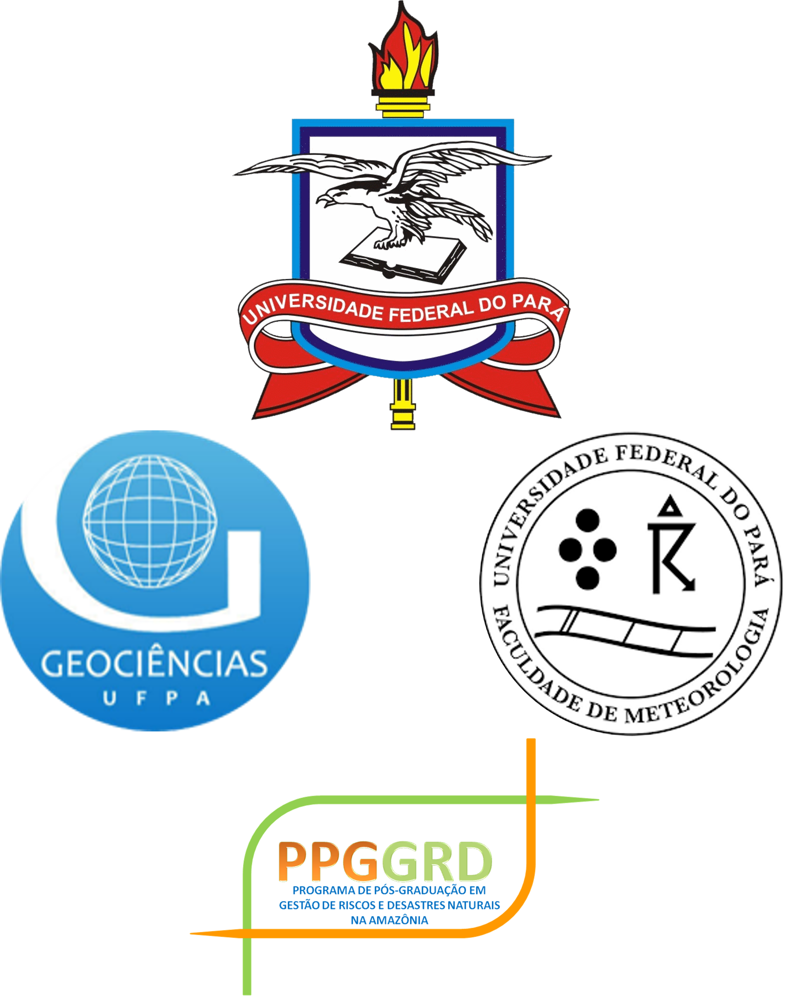

<p align="center">
  
</p>

<h1 align="center">CartoMet BR</h1>

<p align="center">
  <strong>Cartografia Meteorológica para o Brasil</strong><br/>
  Análise sinótica interativa com dados ECMWF Open Data, imagens GOES-East e TSM MUR SST 1km
</p>

<p align="center">
  <a href="#-sobre">Sobre</a> •
  <a href="#-vídeo-demonstrativo">Vídeo</a> •
  <a href="#-novidades-da-v30">Novidades v3.0</a> •
  <a href="#-funcionalidades">Funcionalidades</a> •
  <a href="#-download">Download</a> •
  <a href="#-instalação">Instalação</a> •
  <a href="#-documentação">Documentação</a> •
  <a href="#-autores">Autores</a>
</p>

<p align="center">
  
  
  
  
  <a href="https://codespaces.new/ElivaldoRocha/CartoMet_BR">
    
  </a>
</p>

---

## Sobre

O **CartoMet BR** é uma ferramenta profissional de cartografia meteorológica desenvolvida especificamente para **análise sinótica** no Brasil e América do Sul. O software permite visualizar campos meteorológicos do modelo **ECMWF IFS** em qualquer nível de pressão, sobrepor **imagens de satélite GOES-East** (Banda 13 IR) e **Temperatura da Superfície do Mar** (MUR SST 1km — NASA/NOAA), desenhar simbologias padronizadas WMO e aplicar presets de diagnóstico operacional — incluindo o critério de detecção de ZCAS do CPTEC/INPE (Escobar, 2019).

### Motivação

Este software foi idealizado e desenvolvido como um **presente e expressão de gratidão** às instituições de origem e formação dos autores:

- **UFPA** — Universidade Federal do Pará
- **IG** — Instituto de Geociências
- **FAMET** — Faculdade de Meteorologia
- **PPGGRD** — Programa de Pós-Graduação em Gestão de Riscos e Desastres na Amazônia

O objetivo é oferecer uma ferramenta gratuita que possa ser utilizada em **sala de aula**, auxiliando no ensino de análise sinótica e meteorologia, e também por **profissionais** em suas atividades operacionais de previsão do tempo.

---

## Vídeo Demonstrativo

<p align="center">
  <a href="https://www.youtube.com/watch?v=DNMAWe7L1wA">
    
  </a>
</p>

<p align="center">
  <a href="https://www.youtube.com/watch?v=DNMAWe7L1wA">
    
  </a>
</p>

---

## Novidades da v3.0

### 🗂️ Carta OMM — cabeçalho institucional + legenda no export

- **Arquivo → "Exportar Carta (OMM)…"** transforma o PNG/PDF numa **carta entregável**: um **cabeçalho institucional** (instituição, analista, tipo de carta, **validade/rodada/step auto-preenchidos** da carta, hora de emissão, **logo opcional**) e uma **legenda apenas dos símbolos OMM efetivamente desenhados**
- Defaults lembrados entre sessões (`QSettings`); a mobília é composta **só no arquivo** — a edição ao vivo e o "Salvar Imagem" cru continuam intactos
- Posicionada **fora do mapa** (não altera a geometria travada do Cartopy) e incluída no recorte do export; um espaçador garante os **rótulos de longitude** mesmo sem legenda

### 📈 Meteograma — série temporal num ponto

- Botão **📈 Meteograma**: clique num ponto e veja a **evolução do modelo IFS em +0…+72 h** num painel docado de 4 eixos — **temperatura** (1000 hPa) + **PNMM**, **vento de 10 m** (intensidade + barbelas), **precipitação por intervalo** e **água precipitável**
- Download **serializado por step** (cache-first, anti-429) em **thread** — a GUI nunca trava; *badge* de honestidade (previsão **pontual** do modelo, aproximada)

### 🌹 Rosa dos Ventos — distribuição direção×velocidade num ponto

- Botão **🌹 Rosa dos Ventos**: clique num ponto e veja num painel docado a **distribuição do vento previsto** (IFS, 10 m ou nível de pressão) ao longo dos steps da rodada — **de onde sopra**, com que **intensidade** (faixas de velocidade empilhadas) e quanto de **calmaria** (centro)
- Reusa o download do meteograma (cache-first, anti-429) em **thread**; render **próprio** em eixo polar (**sem** a dependência `windrose`); combo **Setores** (8/16/36) re-bina a série já baixada **sem rede**
- Botão **"Configurar…"**: **nível** (10 m ou um dos **13 níveis isobáricos** — 1000…50 hPa, reusando o GRIB de perfil do Skew-T por step), **faixas de velocidade** customizáveis, **limiar de calmaria** e a linha **"vento médio · rumo predominante"**; persistida entre sessões; sobre relevo alto, steps sem o nível pedido são pulados com aviso
- **📌 Fixar no mapa**: ancora a rosa como **inset georreferenciado** nas coordenadas do ponto — escala com o zoom, acompanha o *pan* (oculta durante o gesto, volta no repouso — a carta segue fluida), recortada ao retângulo da carta, sobrevive à troca de tema/região e entra no export; **salva no projeto `.cmbr`** (dado já binado — abrir não baixa nada); **"Limpar"** remove todas
- *Badge* de honestidade: é a distribuição da **previsão**, **não** uma climatologia (mistura padrão sinótico + ciclo diurno de horas locais distintas) — *não confundir* com o **indicador de norte** (triângulo+N) da aba de traçado

### 🔪 Corte Vertical — seção (cross-section) A→B

- Botão **🔪 Corte Vertical**: **dois cliques** (A → B) definem a reta e o painel desenha a **seção pressão × distância** de **ω** (ascendência/subsidência), **temperatura**, **umidade específica** e **vento**, por interpolação ao longo do caminho (13 níveis)
- Eixo de pressão logarítmico invertido; re-desenha ao mudar **step/rodada**

### 🌩️ Campos de instabilidade — CAPE/CIN/LI/K

- Novo grupo **Instabilidade** no painel: **K-index** na grade nativa (vetorizado, rápido); **Lifted Index, CAPE e CIN** com ascensão de parcela em **grade engrossada** (interpolada de volta), em thread com progresso
- Render **contínuo** (níveis por percentil), **sem classes/limiares inventados** — produto do modelo (13 níveis), rotulado **"aprox."**; entram como camadas PL togglável/removíveis

### 💾 Projeto de análise (`.cmbr`)

- **Salvar/abrir** o **traçado manual + estado do mapa** num arquivo `.cmbr` (JSON versionado) — *handover* de turno, reedição e versionamento da carta
- Reabrir **restaura offline** os desenhos/emojis/anotações e o enquadramento (**nunca dispara rede sozinho**); as camadas calculadas são **memorizadas para reativação manual** (*human-in-the-loop*)

### 📤 Boletim de Análise Codificado (CODSAS)

- **Exporta o traçado humano** num boletim de **texto aberto e compartilhável**, no espírito do *coded surface bulletin* do WPC/NOAA — frentes, ZCAS, ZCIT, cavados, altas/baixas e anotações como sequências de coordenadas `lat,lon` (decimais assinadas: o encoding compactado do WPC não representa longitude a leste de Greenwich, onde a ZCIT chega)
- **Importa** boletins CODSAS **e boletins WPC genuínos** (via MetPy) de forma **aditiva e offline** — as feições entram no histórico (Desfazer funciona) e o mapa **auto-enquadra** se o boletim cair fora do enquadramento
- Preenche a lacuna institucional: permite **compartilhar, arquivar e montar um banco de análises sinóticas** da América do Sul (menu *Arquivo*)

### Índice ZCIT (LOCZCIT-PA) — Potencial Acoplado

- Novo índice integrado que localiza a **Zona de Convergência Intertropical** fundindo **três forçantes** do ECMWF IFS Cycle 50r1 que precisam coexistir espacialmente:
  - **∇TSM** — gradiente térmico do oceano (*skin temperature*, máscara `lsm ≤ 0.2` que preserva a costa do Amapá/Marajó)
  - **C** — convergência do vento de baixos níveis (10 m), via MetPy
  - **F<sub>OLR</sub>** — Radiação de Onda Longa **desacumulada** (Técnica B: rodada anterior madura, steps 12−9, mitigando o *spin-up* da microfísica)
- Normalização Min-Max meridional (Navalha de Ockham) → **máscara ativa acoplada** `oceano ∧ (OLR<240 ∨ C>C_THR)` + **envelope sazonal de latitude** → classificação por limiares físicos de OLR num **raster categórico de 4 classes**: 🔴 Forte (≤180 W/m²), 🟡 Moderada (≤210), 🟢 Fraca (≤240) e 🟣 **Cinemática** (>240, banda ativa por convergência — o ramo sul resgatado); céu limpo verdadeiro fica transparente
- A **máscara ativa resgata o ramo sul** da ZCIT (nítido na convergência, cego na OLR) e o **envelope sazonal** rejeita transientes subtropicais sem clipar a banda. Filtro de **Coerência Espacial (LISA / Moran Local)** opcional ao IQR (extra `spatial`)
- **Overlay opcional do eixo** (banda simples/dupla, com nó de bifurcação) — camada togglável, desligada por padrão, que orienta sem substituir o traçado manual
- Botão **🛰 ZCIT (LOCZCIT-PA)** no painel *Análises prontas* — calcula em *thread*, auto-enquadra no Atlântico equatorial e injeta o raster como **guia visual** para o traçado manual da simbologia `[6] ZCIT` (*human-in-the-loop*)
- Render com `pcolormesh` + `ListedColormap` + `BoundaryNorm` (blocos exatos, sem vazamento de cor); costa/fronteiras/estados visíveis por cima
- Menu **Ajuda → "Sobre o Índice ZCIT (LOCZCIT-PA)"** com categorias, cores, limiares e a metodologia completa. Linhagem científica: **Rocha (2022)**, **Ferreira et al. (2005)**

### Refinamentos científicos e de engenharia (v3.0.0)

Endurecimento do motor LOCZCIT-PA após auditoria de código e *peer review* científico:

- **Coerência Espacial (LISA / Moran Local)** — novo método de delimitação da banda, **alternativo ao IQR**, oferecido num **modal** ao acionar o índice. Isola o *envelope* contíguo da convecção por *hotspots* estatisticamente significativos (convecção cercada por convecção); mais robusto contra sistemas órfãos sem amputar excursões legítimas da banda. **Opcional** (extra `spatial`: `esda`, `libpysal`); o IQR continua o padrão rápido. Reprodutível (semente fixa).
- **Mitigação da Camada Quente Diurna (DWL)** — suavização Gaussiana *ciente-de-NaN* da *skin temperature* sobre o oceano **antes** do ∇TSM (mascara o continente primeiro, então **não contamina a costa**), atenuando o ruído diurno apontado pela revisão científica
- **Consistência temporal da OLR** — a desacumulação genérica agora **ancora a data da rodada** na requisição de rede (antes podia baixar a "mais recente" e rotular o cache errado)
- **Anti-404 pós-144 h** — o *step*-alvo da Técnica B é arredondado à **grade publicada do IFS** (3 h até 144 h; 6 h além), evitando *steps* inexistentes (ex.: 147/153)
- **Triangulação temporal unificada (DRY)** — a regra de tempo da OLR madura tem agora uma **fonte única** (`olr_timing.py`), compartilhada pelo motor e pela camada de serviços, com *fallback* de data robusto
- **Documentação científica harmonizada** — metodologia alinhada ao código: vocabulário de *spin-up*, justificativa honesta da `skt`/DWL, pesos iguais ancorados em **Dawes (1979)**, natureza *relativa por meridiano* da normalização, ressalva ao IQR e documentação do LISA

### 🌀 Bloqueio Atmosférico (Z500)

- Nova **Análise Pronta** (botão azul no painel) que calcula e plota a **anomalia de altura geopotencial em 500 hPa** — o campo `gh` do IFS (rodada + *step* selecionados) menos a **climatologia diária**: `anomalia = gh − z500_clim`
- **Climatologia ERA5 1991–2020** própria (00Z/12Z, média anual + 4 harmônicos via FFT, setor 150°W–30°E / 75°S–15°N, 0.25°), na **mesma grade do IFS Open Data** → subtração direta, sem regrid. Distribuída no próprio repositório (`climatology/z500/` — 366 NetCDFs + `manifest.json`) e baixada **só o arquivo do dia** (~800 KB), com verificação **sha256**, retentativas com *backoff* e **cache local** — funciona offline depois do primeiro acesso
- Render **divergente** (`RdBu_r`, níveis fixos de 40 gpm) com o **contorno do zero** destacado e **auto-enquadramento** no setor; camada togglável/removível no painel de camadas
- **Leitura sinótica:** anomalias **positivas persistentes** (≳ +100 gpm) em latitudes médias-altas sinalizam **bloqueio**; o clássico padrão **ômega** aparece como **dipolo A–B** (cordilheira anticiclônica ladeada por cavados). Em rodadas **06Z/18Z** usa-se o *slot* climatológico mais próximo, sinalizado com **"≈"** na carta
- Cálculo e download em **thread separada** (cancelável); o GRIB de `gh` 500 hPa **compartilha o cache** com a camada normal de geopotencial
- Menu **Ajuda → "Sobre a Análise de Bloqueio (Z500)"** com resumo e a metodologia completa. Climatologia: **ERA5** (Hersbach et al., 2020) via **Copernicus Climate Change Service (C3S)**

### 🌡 Diagnóstico Baroclínico (apoio ao traçado manual de frentes)

- Novo botão nas **Análises Prontas** que empilha, no nível escolhido (**850 hPa** por padrão, via diálogo), um conjunto de campos diagnósticos objetivos para o **traçado manual** de frentes — *human-in-the-loop*: o software **orienta**, o meteorologista **classifica e traça**
- **Ligados por padrão:** **Gradiente de θe** (sombreado — intensidade do contraste entre massas de ar) e **Eixo da Frente — TFP** (*Thermal Front Parameter* = 0, Hewson 1998; **linha neutra-guia**, mascarada por `|∇θe|` mínimo). **Disponíveis, desligados:** **Advecção de θe** (auxilia a classificação fria/quente), **θe** e **Frontogênese de Petterssen**
- **Máscara de terreno elevado** nos campos de θe: onde a pressão de superfície é menor que o nível, o θe a 850 hPa é subterrâneo/fictício — mascarado para o eixo TFP **não desenhar frentes-fantasma sobre os Andes**
- Os quatro campos de θe também ficam **avulsos** em *Campos em Altitude*. Substitui a abordagem de detecção/traçado **automático** de frentes (abandonada por não convergir com a análise sinótica humana — cartas da Marinha do Brasil)

### 🎬 Animação de Steps (GIF/MP4)

- **Arquivo → "Exportar Animação (GIF/MP4)…"** (`Ctrl+Shift+A`) ou botão **"🎬 Animar Steps…"** no painel *Previsão*: a **composição atual do mapa** (sinótica, campos em altitude/presets, **Bloqueio Z500**, **ZCIT LOCZCIT-PA**) é re-renderizada para cada *step* do intervalo escolhido e exportada como **GIF** (sempre disponível) ou **MP4 H.264** (extra `animation`)
- O diálogo **só oferta steps válidos para a rodada** (06Z/18Z ≤ +144h; 00Z/12Z ≤ +240h) — impossível pedir um alcance inexistente. Passo nativo (3h; 6h após +144h) ou 6/12/24h; velocidade 1–6 quadros/s; 100 ou 150 DPI
- **Escala congelada**: níveis de contorno/colorbar fixados pelas estatísticas do intervalo inteiro — a carta não "respira" entre quadros; título com rodada/step/validade atualiza a cada quadro
- Pipeline em 3 fases com **preview ao vivo** no canvas, progresso unificado (inclui retries HTTP 429) e **cancelamento**; download **cache-first** (steps já baixados não vão à rede); ao final a composição original é **restaurada**
- Com o filtro **LISA** do LOCZCIT-PA ativo, o diálogo avisa o custo (Monte Carlo por quadro) e sugere IQR — LISA disponível por opt-in (semente fixa = quadros consistentes)
- **Leitura sinótica em movimento:** deslocamento de frentes e da espessura, a **persistência** de um bloqueio (critério temporal!) num loop de 5–10 dias, e a migração da banda da ZCIT ao longo da rodada

### 🗺 Mapa regional de um clique — recorte por estado, cidades e contornos destacados

- **Combo "Estado:"** no painel *Região* com as **27 UFs**: recorta a carta atual para o estado escolhido **preservando os dados carregados** (diferente do combo Região, que troca o domínio e limpa tudo); zoom/pan manual desmarca a seleção sozinho
- **Camada "Cidades"** (checkbox em *Camadas sinóticas*): sedes municipais **IBGE** com nome — capitais em negrito e cidades maiores primeiro, com halo legível sobre satélite. Seletor **Densidade** (Baixa / **Média** / Alta / Máxima), como o das observações: mais densidade = mais sedes rotuladas, ajustadas ao zoom. Base empacotada (`assets/cidades_br.csv`, 2 678 municípios) — **sem rede e sem dependências novas**
- **"Destacar contornos"** (checkbox): engrossa costa, fronteiras e divisas de estados com **halo de contraste** — essencial sobre **imagem de satélite** e campos preenchidos, onde as linhas finas do mapa base somem; **liga sozinho ao ativar o satélite**
- **🧭 Rosa dos ventos** (checkbox): indicador de norte geográfico — triângulo preto + "N", padrão cartográfico clássico — no canto superior direito da carta, legível sobre qualquer fundo
- Fluxo típico (inspirado no editor de cartas do SIPAM): escolher o estado → ligar *Cidades*, *Destacar contornos* e *Rosa dos ventos* → carimbar **emojis meteorológicos** e simbologia OMM → **📤 Exportar** PNG/PDF
- O título da carta agora **sobrevive ao zoom por scroll e ao pan** (o layout se re-assenta ao fim do gesto), e a marca d'água ganhou halo — legível em qualquer fundo

### ✏ Caneta e ⬜ Formas customizáveis

- **Caneta (traço livre)** — pressione e arraste para rabiscar a carta com o **mouse ou mesa digitalizadora** (o tablet funciona como mouse de precisão). Cor (8 presets meteorológicos + cor personalizada via diálogo), espessura (1–10 pt) e opacidade ajustáveis no painel **Simbologias**. Decimação de pontos mantém o traço fluido mesmo em tablets de alta taxa
- **Formas** — **Retângulo, Elipse/Círculo, Seta e Linha reta** por arraste com *preview* ao vivo, e **Polígono livre** por cliques nos vértices (Enter ou duplo-clique fecha). Borda, **preenchimento opcional**, espessura, estilo (sólida/tracejada/pontilhada) e opacidade customizáveis
- Tudo integrado ao **undo/redo** ([Z]/[Y]/`Ctrl+Z`/`Ctrl+Y`), ao **[C] Limpar** e ao `Esc` (cancela o rascunho em andamento); modos mutuamente exclusivos com simbologias, emojis, zoom/pan e Sonda Vertical
- Render seguro no GeoAxes do Cartopy pela **doutrina dos códigos poligonais** (`PathPatch` apenas com MOVETO/LINETO/CLOSEPOLY — sem códigos curvos), validada por spike e pelo precedente dos símbolos pontuais

### Observações de superfície — SYNOP e METAR

- Sobreposição de **observações reais** à análise do modelo, para identificar com precisão frentes, ciclones e cavados (pedido do meteorologista Gustavo C. J. Escobar)
- **METAR (horário)** via NOAA Aviation Weather Center e **SYNOP (6/6h)** via OGIMET
- *Station model* completo (T, Td, PNMM, barbelas de vento, cobertura de nuvens, tempo presente) com `metpy.plots.StationPlot`
- **Sincronização temporal**: as observações usam o `valid_time` do modelo carregado
- **Densidade ajustável** (Baixa / Média / Alta / Máxima — padrão **Alta**) via seletor no painel, com afinamento (`reduce_point_density`) que também responde ao zoom; densidade Máxima ≈ produto GEMPAK. Trocar a densidade re-renderiza na hora, sem novo download
- Liga/desliga por checkbox no painel **Observações de superfície** (re-renderiza só o overlay; rede em thread; falhas não travam a interface)

### Sonda Vertical — Radiossondagem (Skew-T Log-P)

- Botão **📍 Sonda Vertical** na barra principal: ative e **clique no mapa** — o sistema **ancora (*snap*) automaticamente na estação de radiossonda mais próxima** (lista RAOB curada: Belém 82193, Fortaleza, Natal, Manaus, Brasília, Galeão, Porto Alegre…) e desenha um marcador temporário
- **Duas fontes** no seletor do painel: **Observada (Wyoming)** — a radiossonda real (só **00Z/12Z**); e **Modelo (IFS)** — **pseudo-sondagem** dos 13 níveis em **qualquer ponto clicado**, inclusive **oceano** e **steps de previsão**, onde não há radiossonda (rotulada como aproximada — *não* é observação)
- O perfil abre num **painel lateral direito deslizante** (`QDockWidget`): o meteorologista vê o **mapa 2D à esquerda e o Skew-T à direita ao mesmo tempo** — sem pop-ups que escondam o contexto (UX *Single Page*)
- Diagrama completo via **MetPy**: **Skew-T Log-P** (temperatura, orvalho, perfil da parcela, sombreamento de CAPE/CIN, barbelas de vento), **hodógrafo** e **tabela de índices** termodinâmicos (CAPE, CIN, LCL, LFC, EL, Água Precipitável, Showalter)
- **Sincronia temporal mestra**: o painel é *escravo* do seletor de **Step** do mapa — avançar o horário recarrega a sondagem automaticamente. A radiossonda (lançada só às **00Z/12Z**) é buscada no horário sinótico mais próximo do `valid_time`
- **Fail-states elegantes**: dados baixados da **Universidade de Wyoming** (interface WSGI atual via cliente próprio `data/wyoming.py` — FM35 com fallback BUFR; `siphon` fica só como reserva de rede) em **`QThread`** — a GUI nunca congela; "balão não lançado" e instabilidade de rede viram mensagens amigáveis distintas; horário **futuro** é bloqueado **sem** tocar no servidor
- Robustez de sensor: cada índice e o hodógrafo são calculados isoladamente — uma sonda com vento defeituoso em altitude **não derruba** o resto do diagrama

### Zoom no mapa

- **Roda do mouse**: zoom in/out centrado no cursor (lupa sobre a carta)
- **✋ Mover**: arraste para deslocar o mapa
- **🔍 Zoom área**: desenhe um retângulo para **recortar e replotar** a carta, recalculando os centros H/L e reafinando as estações para o novo domínio
- **↩ Anterior** (pilha de extents) e **🏠 Resetar** / `Home` / `Ctrl+0` (volta ao extent da região); `Esc` cancela o retângulo
- Modos mutuamente exclusivos com Desenho / Anotação / Régua / Emoji — o modo ativo aparece na barra de status (`Ctrl+Z`/`Ctrl+Y` permanecem reservados ao desenho)

### Correção crítica — rodadas 06Z/18Z (IFS Cycle 50r1)

- Desde o **IFS Cycle 50r1 (13/05/2026)**, os streams `scda`/`scwv` (rodadas 06Z/18Z) foram descontinuados no ECMWF Open Data e migraram para o stream `oper`
- O CartoMet BR agora fixa explicitamente `stream="oper"` nas requisições, restaurando o download das **quatro rodadas (00/06/12/18Z)** — verificado com download real da 06Z
- Dependência `ecmwf-opendata` atualizada para `>=0.3.29` (suporte oficial ao 50r1)
- A mensagem de erro enganosa ("steps múltiplos de 3") foi substituída por uma orientação clara para o usuário final (use 00Z/12Z; a 18Z publica ~01:30 UTC)

---

## Novidades da v2.2

### Emojis Meteorológicos Coloridos no Mapa

- **36 emojis** organizados em 6 categorias: Céu/nuvens, Precipitação, Fenômenos extremos, Frio/inverno, Calor/seca, Estações do ano e Outros
- Renderização full-color via pipeline nativo do Qt (Segoe UI Emoji / Apple Color Emoji / Noto Color Emoji) — sem preto/monocromático
- Painel com ícones coloridos e identificáveis (tooltip com nome ao passar o mouse)
- Tamanhos P / M / G configuráveis
- Emojis ancorados às coordenadas geográficas corretas no mapa
- Desfazer / Limpar funcionam inclusive quando há campos sinóticos carregados

### Botão "Aplicar Região"

- Novo botão no painel de configurações: após editar manualmente os campos Lon Min/Max e Lat Min/Max, clique **↻ Aplicar Região** para atualizar o mapa imediatamente sem precisar alterar o combo de regiões predefinidas

### Novos contextos ambientais e climáticos

- Adicionados emojis de **queimada** (🔥), **seca** (🌵 🏜), **ciclone tropical** (🌀), **vulcão/cinzas** (🌋), **calor extremo** (🥵), **frio extremo** (🥶), **neve em altitude** (🏔), além das quatro estações (🌸 🌻 🍂 ⛄)

---

## Novidades da v2.1

### Temperatura da Superfície do Mar (TSM) — MUR SST 1km

- **Nova fonte de dados**: NASA/NOAA MUR SST via ERDDAP server-side subsetting
- Resolução nativa 0.01° (~1 km) — a mais alta resolução SST operacional disponível
- Download otimizado: recorte feito no servidor (ERDDAP), não via OPeNDAP lento
- Progresso real em bytes durante o download (~16 MB para América do Sul)
- Paleta `RdYlBu_r` com colorbar horizontal dedicada
- Painel próprio no dock esquerdo (abaixo do Satélite GOES) com seletor de data e toggle
- Cache local automático por data — reutiliza sem re-download
- Integração com título dinâmico do mapa (sozinha ou combinada com outras camadas)

### Convergência de Umidade (MFC) — Variável derivada
- Calculada a partir de q, u e v: `MFC = -(adv_q + q * div_v)`
- Disponível em qualquer nível de pressão no painel "Campos em Altitude"
- Paleta BrBG simétrica (convergência positiva = convecção favorecida)

### Painel de Camadas Reorganizado
- **Campos em Altitude**: 13 variáveis (t, r, q, gh, wind, isotacas, w, d, vo, adv. T, grad. T, frontogênese, MFC)
- **Campos de Superfície/Integrados**: OLR e Água Precipitável — botão dedicado, sem necessidade de selecionar nível

### Importação Offline de Arquivos GRIB2
- Menu **Dados → Importar Arquivo Local** (Ctrl+I)
- Reconhece o padrão de nome ECMWF do CartoMet e restaura o contexto completo:
  - Arquivo MSL → reconstrói carta sinótica com PNMM + Espessura automaticamente
  - Arquivo PL/Superfície → injeta camada via pipeline oficial (conversões, suavização, colorbar)

### Captura Pixel-Perfect do Mapa
- **Ctrl+P** — Captura o mapa exatamente como exibido na tela (via `QWidget.grab`)
- **Ctrl+S** — Exportação tradicional via `savefig` (200 DPI, layout recalculado)

### Título Dinâmico do Mapa
- Atualiza automaticamente ao adicionar, ocultar ou remover camadas
- Linha 1: campo ativo + base sinótica (ex: "Temperatura 850 hPa (°C) + PNMM (hPa)")
- Linha 2: `Rodada: 12Z 24/03/2026 | Step: +3h | Válido: 2026-03-24T15:00 UTC`

### Feedback de HTTP 429 na GUI
- Intercepta retries automáticos do ECMWF e exibe na barra de progresso
- Mensagens claras: "Servidor ocupado (HTTP 429) — tentativa N, aguardando 2min..."
- Label de status em vermelho durante retries, laranja durante progresso normal

### Seletor de Minutos no Satélite
- Campo de minutos (00, 10, 20, 30, 40, 50) para seleção precisa de imagens GOES
- Validação com aviso se horário futuro selecionado

---

## Funcionalidades da v2.0

### Imagem de Satélite GOES-East
- Download direto do AWS S3 (NOAA) — sem autenticação
- Banda 13 (IR 10.3μm) com paleta clássica IR AVHRR
- Seletor de data e hora (00Z a 23Z) com validação
- Suporte a GOES-19 (operacional) com fallback para GOES-16
- Cache automático de arquivos já baixados

### Sistema de Camadas Independentes
- Empilhamento livre de camadas com toggle instantâneo (liga/desliga sem re-download)
- Colorbar inset que não rouba espaço do mapa
- Zorder crescente com simbologias sempre no topo

### 15 Variáveis Meteorológicas

| Variável | Descrição | Unidade |
|----------|-----------|---------|
| `t` | Temperatura | °C |
| `r` | Umidade Relativa | % |
| `q` | Umidade Específica | g/kg |
| `gh` | Geopotencial | mgp |
| `wind` | Vento (barbelas, vetores ou correntes) | kt |
| `wind_speed` | Isotacas (velocidade do vento) | km/h |
| `w` | Velocidade Vertical (ω) | hPa/h |
| `d` | Divergência | ×10⁻⁵ s⁻¹ |
| `vo` | Vorticidade Relativa | ×10⁻⁵ s⁻¹ |
| `olr` | Radiação de Onda Longa (OLR) | W/m² |
| `tcwv` | Água Precipitável | mm |
| `tmax2m` | Temperatura Máxima 2 m (janela 3h/6h) | °C |
| `tmin2m` | Temperatura Mínima 2 m (janela 3h/6h) | °C |
| `temp_adv` | Advecção de Temperatura | °C/h |
| `temp_grad` | Gradiente de Temperatura | °C/100km |
| `frontogenesis` | Frontogênese de Petterssen | °C/100km/3h |
| `mfc` | Convergência de Umidade (MFC) | ×10⁻⁵ g/kg/s |

### Presets de Análise para Sala de Aula

| Preset | Camadas |
|--------|---------|
| **Sinótica clássica** | Vento 850 vetores + Advecção de T 850 |
| **Jato e divergência** | Vento 250 correntes + Isotacas 250 + Divergência 200 |
| **Baixos níveis** | Vento 925 vetores + Advecção de T 925 + UR 850 |
| **Convecção profunda** | Divergência 200 + Omega 500 + Vorticidade 850 |
| **ZCAS (Escobar)** | Água Precipitável + Vento 850 vetores + Omega 500 |

### Ferramentas Pedagógicas
- **Anotações no mapa** — Clique e digite "ZCIT", "JBN", "ASAS", "Zona Baroclínica", etc.
- **Régua de distância** — Meça distâncias em km entre pontos (fórmula de Haversine)
- **Modos exclusivos** — Desenho, Anotação e Régua não se misturam

### Interface
- Janela de boas-vindas com créditos e logos institucionais
- 6 temas de mapa: Clássico, Branco, Pastel, Tons de cinza, Terra, Escuro
- Seletor de rodadas ECMWF com estimativa de disponibilidade
- Diálogo de progresso com barra de download e botão cancelar
- Limpeza automática de arquivos parciais ao cancelar download

---

## Resumo de Recursos

| Recurso | Descrição |
|---------|-----------|
| **Dados ECMWF** | Download automático de dados gratuitos do modelo IFS (resolução 0.25°) |
| **Reanálise ERA5 (CDS)** | Fonte de **reanálise** Copernicus (não previsão) em painel dedicado, por **data/hora absolutas**. **Agregação por variável:** cada campo oferece só os modos fisicamente válidos, com default e **unidade corretos** — precipitação → *total do período* (mm, padrão), *total diário médio* / *dia mais chuvoso* (mm/dia) ou 1 h (mm/h); rajada → *máxima* (pico); Temp. Máx/Mín 2 m dedicadas → *média das máximas/mínimas diárias* (Tmáx/Tmín climatológica); estado → média/instantâneo/extremo; campos diurnos ainda dão *média à hora fixa* (ex.: média só das 12 UTC). **Superfície:** Temp. 2 m, Temp. Máx/Mín, ponto de orvalho, vento 10 m e rajada, PNMM, precipitação, água precipitável, cobertura de nuvens, **TSM bulk** (que o IFS grátis não tem), **radiação** (OLR + onda curta/longa no topo e superfície), CAPE, Índice K, Total Totals. **Níveis de pressão** (13 níveis): geopotencial, temperatura, vento, umidade relativa e específica, ω, vorticidade, divergência. **Índices de evento** (período): chuva → CDD (veranico), CWD, Dias Úmidos, Rx5day; temperatura → Dias Quentes / Onda de Calor (limiar do usuário) e Noites Quentes (Tmin>20 °C) — limiares ETCCDI/OMM. Recorte no servidor, NetCDF, cache local; sobreponível ao IFS para verificação. **Piso seco por unidade** (IFS e ERA5): chuva abaixo do limiar fica transparente — 0,1 mm em janelas curtas (mm/h, mm/3h; precip. mensurável) e 1,0 mm/dia no diário/total (dia com chuva, OMM). Botão **📉 Série no ponto**: clique no mapa para a evolução **horária** ao longo do período. Requer chave gratuita do CDS (Arquivo → "Chave ERA5 (CDS)"). Publicada com ~5 dias de atraso (ERA5T) |
| **Índice ZCIT (LOCZCIT-PA)** | Localização da ZCIT acoplando ∇TSM + convergência + OLR desacumulada num raster categórico de 4 classes (Forte/Moderada/Fraca/Cinemática), com máscara ativa, envelope sazonal e overlay opcional de eixo — guia para o traçado manual |
| **Bloqueio Atmosférico (Z500)** | Anomalia de altura geopotencial em 500 hPa (`gh` − climatologia ERA5 1991–2020) com render divergente e contorno do zero — realça cordilheiras de bloqueio e o padrão ômega; climatologia baixada por dia (cache + sha256) |
| **Diagnóstico Baroclínico** | Empilha campos de apoio ao traçado **manual** de frentes no nível escolhido: Gradiente de θe + Eixo TFP (linha-guia) ligados; Advecção de θe, θe e Frontogênese disponíveis — máscara de terreno (Andes); *human-in-the-loop* |
| **Sonda Vertical (Skew-T)** | Radiossondagem observada (Wyoming) **ou** pseudo-sondagem do modelo IFS em qualquer ponto (oceano/previsão) — Skew-T, hodógrafa e índices via MetPy |
| **Meteograma** | Série temporal do IFS num ponto (+0…+72 h): T, vento, precipitação, PNMM e água precipitável |
| **Rosa dos Ventos** | Distribuição direção×velocidade do vento previsto (IFS, 10 m ou um dos 13 níveis isobáricos) num ponto ao longo dos steps da rodada — setores, faixas de velocidade e calmaria configuráveis, estatísticas (vento médio · rumo predominante); render próprio (sem `windrose`), previsão e não climatologia; **fixável** como inset georreferenciado no mapa e salva no `.cmbr` |
| **Corte Vertical (A→B)** | Seção pressão × distância de ω, temperatura, umidade e vento ao longo de uma reta desenhada |
| **Instabilidade (CAPE/CIN/LI/K)** | Campos de instabilidade derivados do modelo — K-index nativo; LI/CAPE/CIN em grade engrossada; render contínuo (aprox.) |
| **Carta OMM** | Export com cabeçalho institucional (instituição/analista/validade/logo) + legenda dos símbolos — PNG/PDF entregável |
| **Projeto de análise (.cmbr)** | Salvar/abrir o traçado manual + estado do mapa; restauração offline (*human-in-the-loop*) |
| **Boletim Codificado (CODSAS)** | Exporta/importa as feições traçadas como boletim de texto estilo WPC adaptado à América do Sul (`lat,lon` decimais); importa boletins WPC genuínos (MetPy) com auto-enquadre |
| **Observações SYNOP/METAR** | Sobreposição de observações reais de superfície (METAR via NOAA AWC; SYNOP via OGIMET) sincronizadas com o `valid_time` do modelo |
| **Caneta e Formas** | Traço livre (mouse/mesa digitalizadora) e formas customizáveis (retângulo, elipse, seta, linha, polígono) com cor, preenchimento, espessura, estilo e opacidade — integrados ao undo/redo |
| **Zoom no mapa** | Zoom por roda do mouse, pan, recorte por retângulo (replota e reafina estações), histórico de extents (Home/Ctrl+0) |
| **Satélite GOES-East** | Imagem IR Banda 13 com paleta clássica, seleção por data/hora/minuto |
| **TSM — MUR SST 1km** | Temperatura da Superfície do Mar operacional (NASA/NOAA via ERDDAP) |
| **Carta de Superfície** | PNMM, Espessura 1000-500 hPa, Centros H/L automáticos (máscara orográfica dos Andes + ranqueamento por proeminência) |
| **Campos em Altitude** | 15 variáveis em qualquer nível de pressão (925, 850, 700, 500, 300, 250, 200 hPa) |
| **Variáveis Derivadas** | Advecção de T, Gradiente de T, Frontogênese, MFC, θe, Gradiente de θe, Advecção de θe, Eixo TFP |
| **Variáveis de Superfície** | OLR (paleta clássica), Água Precipitável |
| **Camadas Independentes** | Empilhe campos livremente com toggle liga/desliga |
| **Presets de Análise** | 5 combinações prontas para sala de aula, incluindo ZCAS (Escobar/CPTEC) |
| **10 Simbologias WMO** | Frentes, ZCAS, ZCIT, Cavado, Crista, LI, Dryline |
| **Importação Local** | Restauração offline de arquivos GRIB2 baixados previamente |
| **Anotações** | Texto livre sobre o mapa para identificar sistemas |
| **Régua** | Medição de distância em km |
| **6 Temas** | Clássico, Branco, Pastel, Cinza, Terra, Escuro |
| **Regiões** | América do Sul, Brasil, Nordeste, Sudeste, Sul |
| **Exportação** | PNG, JPEG ou PDF (Ctrl+S) + Captura pixel-perfect (Ctrl+P) + seletor de DPI |
| **Emojis Meteorológicos** | 36 emojis coloridos (clima, estações, fenômenos extremos) ancorados no mapa |

---

## Download

### Versão Atual: 3.1.0

| Arquivo | Descrição | Download |
| --- | --- | --- |
| **Instalador_CartoMet_BR_v3.1.0.exe** | Instalador para Windows (recomendado) | [Download](https://github.com/ElivaldoRocha/CartoMet_BR/releases/latest) |
| **CartoMet_BR_v3.1.0_Windows.zip** | Versão portátil — sem instalação (ideal para máquinas sem permissão de administrador) | [Download](https://github.com/ElivaldoRocha/CartoMet_BR/releases/latest) |

> **Dica:** Sem permissão de administrador? Use o ZIP portátil — extraia a pasta e execute `CartoMet_BR\CartoMet_BR.exe` diretamente.

---

## Instalação

### Método 1: Instalador Windows (Recomendado para Usuários Windows)

1. Baixe `Instalador_CartoMet_BR_v3.0.1.exe` na seção [Releases](https://github.com/ElivaldoRocha/CartoMet_BR/releases/latest)
2. Execute o instalador e siga as instruções
3. Abra o CartoMet BR pelo atalho no Menu Iniciar ou Desktop

### Método 2: GitHub Codespaces (Sem instalar nada — roda no navegador)

Ideal como **plano B** quando a instalação local falha por incompatibilidade de drivers ou dependências de sistema.

1. Na página do repositório clique em **`<> Code` → aba `Codespaces` → `Create codespace on main`**
2. Aguarde ~3 minutos enquanto o ambiente Linux é criado e o `uv sync` roda automaticamente
3. Uma aba com o **Desktop Remoto** abrirá no navegador — use a senha **`carto`**
4. No terminal do VS Code (no navegador), execute:

```bash
uv run python -m cartomet_br gui
```

5. Troque para a aba do Desktop Remoto — a interface gráfica do CartoMet BR aparecerá lá

> **Como funciona:** O GitHub sobe uma VM Linux com servidor noVNC (porta 6080). O Qt renderiza
> numa tela virtual e o noVNC transmite a imagem para o seu navegador. Não requer instalação
> local de nenhuma dependência.

> **Custo:** O plano gratuito do GitHub inclui 120 horas/mês de Codespaces. O arquivo
> `devcontainer.json` já configura `shutdownAction: stopCodespace` para parar automaticamente
> ao fechar a aba.

---

### Método 3: Código-Fonte — Windows, Linux e macOS

#### Pré-requisitos

| Dependência | Por quê |
|-------------|---------|
| **Python 3.12+** | Linguagem do projeto |
| **Git** | Para clonar o repositório |
| **GEOS / PROJ / eccodes** | Bibliotecas C exigidas pelo Cartopy e cfgrib (veja abaixo) |

#### Windows

```bash
# Clone o repositório
git clone https://github.com/ElivaldoRocha/CartoMet_BR.git
cd CartoMet_BR

# Instale com UV (recomendado)
uv sync

# Execute
uv run python -m cartomet_br gui
```

```bash
# Alternativa com pip
pip install -e .
python -m cartomet_br gui
```

> **Nota:** No Windows, o `pip install` geralmente resolve GEOS/PROJ/eccodes automaticamente via wheels pré-compilados.

#### Linux (Ubuntu/Debian)

```bash
# 1. Instale as dependências de sistema
sudo apt update
sudo apt install -y libgeos-dev libproj-dev libgl1-mesa-glx libegl1
curl -LsSf https://astral.sh/uv/install.sh | sh

# 2. Clone e execute
git clone https://github.com/ElivaldoRocha/CartoMet_BR.git
cd CartoMet_BR
uv sync
uv run python -m cartomet_br gui
```

> **Nota:** O `uv` detecta o arquivo `.python-version` e baixa o Python 3.12.11 automaticamente — não é necessário instalar Python manualmente.

> **Nota:** O PyQt6 requer `libEGL`. Se a GUI não abrir, instale `libegl1` (Debian/Ubuntu) ou `mesa-libEGL` (Fedora).

<details>
<summary><strong>Fedora / RHEL / CentOS</strong></summary>

```bash
sudo dnf install -y geos-devel proj-devel mesa-libGL mesa-libEGL
curl -LsSf https://astral.sh/uv/install.sh | sh
```

</details>

<details>
<summary><strong>Arch Linux</strong></summary>

```bash
sudo pacman -S geos proj mesa
curl -LsSf https://astral.sh/uv/install.sh | sh
```

</details>

#### macOS

```bash
# 1. Instale as dependências com Homebrew
brew install geos proj uv

# 2. Clone e execute
git clone https://github.com/ElivaldoRocha/CartoMet_BR.git
cd CartoMet_BR
uv sync
uv run python -m cartomet_br gui
```

> **Nota:** O `uv` detecta o `.python-version` e baixa o Python 3.12.11 automaticamente — não é necessário `brew install python@3.12`. Funciona nativamente em Apple Silicon (M1/M2/M3/M4).

> **Atenção:** Não use `pip install -e .` diretamente — o pip ignora o `uv.lock` e pode baixar versões de `eccodes`/`cartopy` com ABI incompatível. Sempre use `uv sync`.

#### Com UV (qualquer plataforma)

```bash
# UV detecta a plataforma e resolve dependências automaticamente
git clone https://github.com/ElivaldoRocha/CartoMet_BR.git
cd CartoMet_BR
uv sync
uv run python -m cartomet_br gui
```

> **Opcional — Coerência Espacial (LISA):** o método avançado de delimitação da ZCIT
> requer dependências extras. Instale com `uv sync --extra spatial` (adiciona `esda` e
> `libpysal`). Sem elas, o índice usa o filtro **IQR** (padrão) — nada quebra.
>
> **Opcional — Exportação MP4:** a animação de steps sempre exporta **GIF**; para
> **MP4 (H.264)** instale com `uv sync --extra animation` (adiciona `imageio-ffmpeg`,
> ~30 MB com o binário do ffmpeg). Sem o extra, a opção MP4 aparece desabilitada com
> a instrução no tooltip — o GIF continua funcionando normalmente.

### Primeira Execução

Na primeira execução, o programa exibirá uma **janela de boas-vindas** e solicitará que você escolha um **diretório de dados** para armazenar os arquivos meteorológicos e de satélite baixados.

> **Recomendação:** Escolha uma pasta dentro de "Documentos", como `Documentos/CartoMet_BR_Data`. Evite pastas do sistema.

---

## Requisitos

| Requisito | Mínimo | Recomendado |
|-----------|--------|-------------|
| **Sistema Operacional** | Windows 10, Ubuntu 22.04, macOS 13+ (64-bit) | Windows 11, Ubuntu 24.04, macOS 14+ |
| **Python** | 3.12 | 3.12+ |
| **Memória RAM** | 4 GB | 8 GB |
| **Espaço em Disco** | 500 MB | 2 GB+ (para dados e satélite) |
| **Conexão** | Internet para download ECMWF, GOES e MUR SST | Banda larga |

---

## Atalhos de Teclado

| Tecla | Ação |
|-------|------|
| `Ctrl+S` | Salvar imagem (savefig — layout recalculado) |
| `Ctrl+P` | Capturar tela do mapa (pixel-perfect) |
| `Ctrl+I` | Importar arquivo GRIB2 local |
| `Ctrl+N` | Novo projeto (reinicia) |
| `Ctrl+Z` | Desfazer desenho |
| `Ctrl+Y` | Refazer desenho |
| `Home` / `Ctrl+0` | Resetar zoom (volta ao extent da região) |
| `Esc` | Cancelar o retângulo de zoom em andamento |
| Roda do mouse | Zoom in/out centrado no cursor |
| Arrastar (✋ Mover) | Deslocar o mapa (pan) |
| `1`–`0` | Simbologias (Frentes, ZCAS, ZCIT, Cavado, etc.) |
| `F` | Inverter símbolos |
| `Enter` | Finalizar linha |
| `Z` | Desfazer ponto |
| `C` | Limpar tudo |

---

## Tecnologias

- **Python 3.12** — Linguagem de programação
- **PyQt6** — Interface gráfica
- **Matplotlib** — Visualização de dados
- **Cartopy** — Projeções cartográficas
- **xarray + cfgrib** — Leitura e manipulação de dados GRIB2
- **SciPy** — Suavização gaussiana e processamento numérico
- **MetPy** — Processamento meteorológico
- **statsmodels** — Suavização robusta LOWESS (overlay de eixo da ZCIT)
- **Universidade de Wyoming (WSGI)** — Radiossondagem observada (Skew-T Log-P; `siphon` como fallback)
- **ECMWF Open Data** — Fonte de dados meteorológicos
- **NOAA GOES-East (AWS S3)** — Imagens de satélite
- **NASA/NOAA MUR SST (ERDDAP)** — Temperatura da Superfície do Mar (1 km)

---

## Fontes de Dados

### ECMWF Open Data
- **Modelo**: IFS (Integrated Forecasting System)
- **Resolução**: ~0.25° (HRES)
- **Atualizações**: 4x ao dia (00, 06, 12, 18 UTC)
- **Alcance**: até 10 dias (144h em steps de 3h, depois 6h)
- **Licença**: [CC BY 4.0](https://www.ecmwf.int/en/forecasts/datasets/open-data)

### NOAA GOES-East
- **Satélite**: GOES-19 (operacional) / GOES-16 (legado)
- **Instrumento**: ABI (Advanced Baseline Imager)
- **Banda**: 13 — IR 10.3μm (temperatura de brilho)
- **Resolução temporal**: Full Disk a cada 10 minutos
- **Fonte**: [AWS S3 noaa-goes19](https://registry.opendata.aws/noaa-goes/)
- **Licença**: Domínio Público

### NASA/NOAA MUR SST

- **Dataset**: Multi-scale Ultra-high Resolution SST (MUR) v4.1
- **Resolução espacial**: 0.01° (~1 km) — a mais alta resolução SST operacional disponível
- **Cobertura**: Global, quasi-diária (latência ~2 dias)
- **Variável**: `analysed_sst` — temperatura em °C (CF conventions)
- **Acesso**: ERDDAP server-side subsetting (download direto do recorte como NetCDF)
- **Fonte**: [CoastWatch ERDDAP — jplMURSST41](https://coastwatch.pfeg.noaa.gov/erddap/griddap/jplMURSST41.html)
- **Licença**: Domínio Público (NASA/NOAA)

### Observações de Superfície — SYNOP e METAR

- **Tipo**: Observações reais de superfície (modelo de estação) sobrepostas à análise do modelo
- **METAR**: relatórios horários de aeródromos via NOAA Aviation Weather Center
- **SYNOP**: relatórios sinóticos de 6/6h (FM-12) via OGIMET, decodificados com `pymetdecoder`
- **Variáveis**: T, Td, PNMM, vento (barbelas), cobertura de nuvens e tempo presente (`metpy.plots.StationPlot`)
- **Sincronização**: usa o `valid_time` do modelo carregado; afinamento por densidade que responde ao zoom
- **Fonte**: [NOAA AWC](https://aviationweather.gov/) (METAR) · [OGIMET](https://www.ogimet.com/) (SYNOP)
- **Licença**: Domínio Público (NOAA) / dados abertos (OGIMET)

### Climatologia de Z500 — ERA5 (Copernicus/C3S)

- **Uso**: base da Análise de **Bloqueio Atmosférico** — anomalia `gh − z500_clim`
- **Dataset**: ERA5 reanalysis (ECMWF) — altura geopotencial em 500 hPa
- **Período**: normais diárias **1991–2020** (30 anos), 00Z e 12Z
- **Processamento**: média anual + 4 harmônicos (FFT; 29/02 interpolado); setor 150°W–30°E / 75°S–15°N a 0.25° (mesma grade do IFS Open Data)
- **Distribuição**: empacotada no repositório (`climatology/z500/` — 366 NetCDFs + `manifest.json` com sha256), baixada por dia e cacheada localmente
- **Fonte/Licença**: [Copernicus Climate Change Service (C3S) — ERA5](https://cds.climate.copernicus.eu/) · Hersbach et al. (2020), doi:10.1002/qj.3803 · Licença Copernicus

---

## Estrutura do Projeto

```
CartoMet_BR/
├── cartomet_br/
│   ├── __init__.py              # Versão e exports
│   ├── __main__.py              # Entry point CLI
│   ├── core/
│   │   └── config.py            # Configurações e validação
│   ├── data/
│   │   ├── ecmwf.py             # Download ECMWF, GOES, VARIABLE_REGISTRY
│   │   ├── sst.py               # Download MUR SST 1km via ERDDAP
│   │   ├── loczcit_pa_engine.py # Motor do índice ZCIT (LOCZCIT-PA)
│   │   ├── olr_timing.py        # Triangulação temporal da OLR (Técnica B) — fonte única
│   │   ├── zcit_axis.py         # Detecção do eixo da ZCIT (centroide + IQR + LOWESS)
│   │   ├── zcit_dual.py         # Banda dupla da ZCIT (bimodalidade + bifurcação)
│   │   ├── spatial_coherence.py # Filtro de Coerência Espacial (LISA / Moran Local)
│   │   ├── blocking_engine.py   # Bloqueio: anomalia de Z500 vs. climatologia ERA5
│   │   ├── raob_stations.py     # Estações RAOB (snap da Sonda Vertical)
│   │   ├── wyoming.py           # Radiossondagem UWyo (interface WSGI nova, CSV)
│   │   ├── wind_rose.py         # Binagem da rosa dos ventos (direção×velocidade, pura)
│   │   └── stations.py          # Observações SYNOP (OGIMET) e METAR (NOAA AWC)
│   ├── symbols/
│   │   ├── base.py              # Classe base e helpers
│   │   ├── fronts.py            # Frentes (fria, quente, etc.)
│   │   ├── effects.py           # ZCAS, ZCIT, cavado, crista, LI, etc.
│   │   └── point_symbols.py     # Ciclone, tempestade tropical, vórtice
│   ├── charts/
│   │   ├── synoptic.py          # Geração de carta sinótica
│   │   ├── wind_rose_plot.py    # Render polar da rosa dos ventos (theme-agnostic)
│   │   └── interactive.py       # Ferramenta interativa matplotlib
│   ├── services/
│   │   ├── data_service.py      # Camada de serviço (validação, logging)
│   │   └── animation_service.py # Animação: steps válidos, escala congelada, GIF/MP4
│   ├── gui/
│   │   ├── main_window.py       # Janela principal (orquestrador)
│   │   ├── map_canvas.py        # Canvas Matplotlib/Cartopy
│   │   ├── drawing_panel.py     # Painel de simbologias
│   │   ├── layer_panel.py       # Painéis de camadas e configurações
│   │   ├── download_dialog.py   # Threads de download e diálogo de progresso
│   │   ├── animation_engine.py  # Animação de steps: workers + orquestrador (3 fases)
│   │   ├── animation_dialog.py  # Animação de steps: diálogo de config/progresso
│   │   ├── draw_tools.py        # Caneta e formas: comandos de desenho serializáveis
│   │   ├── sounding_engine.py   # Worker da radiossondagem (Wyoming WSGI, QThread)
│   │   ├── sounding_panel.py    # Painel lateral Skew-T Log-P (MetPy)
│   │   ├── analysis_panel.py    # Base dos painéis docados (AnalysisDock)
│   │   ├── analysis_engine.py   # Workers QThread: meteograma, rosa dos ventos, corte vertical, instabilidade
│   │   ├── meteogram_panel.py   # Painel do meteograma (série temporal num ponto)
│   │   ├── wind_rose_panel.py   # Painel da rosa dos ventos (distribuição num ponto)
│   │   ├── wind_rose_config_dialog.py # Diálogo de config da rosa (nível/faixas/calmaria)
│   │   ├── cross_section_panel.py # Painel do corte vertical (cross-section A→B)
│   │   ├── chart_export.py      # Montagem (pura) dos metadados da carta OMM
│   │   ├── chart_header_dialog.py # Diálogo do cabeçalho da carta OMM
│   │   ├── project_io.py        # Serialização do projeto de análise (.cmbr)
│   │   ├── bulletin_io.py       # Boletim de análise codificado (CODSAS/WPC)
│   │   ├── dialogs.py           # Welcome, FirstRun
│   │   ├── themes.py            # Temas visuais e estilos
│   │   ├── methodology.py       # Renderiza a metodologia LOCZCIT-PA (md → HTML)
│   │   └── _constants.py        # Metadados e caminhos de assets
│   └── assets/
│       ├── CartoMet_BR_logo_*   # Logos e ícones
│       └── Logos_UFPA_IG_FAMET_PPGGRD.png
├── climatology/
│   └── z500/                    # Climatologia diária de Z500 (ERA5) + manifest.json (sha256)
├── tests/
│   ├── conftest.py
│   ├── test_blocking.py
│   ├── test_chart_export.py     # Carta OMM: metadados (puro)
│   ├── test_chart_furniture.py  # Carta OMM: cabeçalho/legenda (offscreen)
│   ├── test_config.py
│   ├── test_cross_section.py    # Corte vertical A→B (puro)
│   ├── test_data_service.py
│   ├── test_deaccumulation.py
│   ├── test_drawing_history.py
│   ├── test_draw_tools.py
│   ├── test_ecmwf.py
│   ├── test_instability.py      # Campos CAPE/CIN/LI/K (puro)
│   ├── test_interactive.py
│   ├── test_loczcit_pa.py
│   ├── test_olr_deaccum_characterization.py
│   ├── test_point_timeseries.py # Meteograma (puro)
│   ├── test_wind_rose.py        # Rosa dos ventos: binagem (puro)
│   ├── test_wind_rose_plot.py   # Rosa dos ventos: render headless (Agg)
│   ├── test_raob_stations.py
│   ├── test_spatial_coherence.py
│   ├── test_stations.py
│   ├── test_symbols.py
│   ├── test_zcit_axis.py
│   └── test_zoom.py
├── .github/
│   └── workflows/
│       └── ci.yml               # CI: lint, type check, testes
├── pyproject.toml
├── LICENSE
└── README.md
```

---

## Desenvolvimento

### Rodar testes

```bash
uv sync --extra dev

uv run pytest tests/ -v

# Com cobertura
uv run pytest tests/ --cov=cartomet_br --cov-report=term-missing
```

### Linting e type check

```bash
uv run ruff check cartomet_br/
uv run ruff format --check cartomet_br/
uv run mypy cartomet_br/ --ignore-missing-imports
```

### Gerar executável (PyInstaller)

O empacotamento para distribuição — o arquivo `.spec` do PyInstaller e o script do
instalador Inno Setup — é mantido **fora do repositório público**. O build roda a
partir da raiz do projeto, após `uv sync --extra spatial`.

### CI/CD

O projeto usa **GitHub Actions** para rodar lint, type check e testes em cada push e pull request (Ubuntu + Windows).

---

## Contribuindo

1. Faça um fork do projeto
2. Crie uma branch para sua feature (`git checkout -b feature/nova-funcionalidade`)
3. Rode os testes (`uv run pytest tests/ -v`)
4. Commit suas mudanças (`git commit -m 'Adiciona nova funcionalidade'`)
5. Push para a branch (`git push origin feature/nova-funcionalidade`)
6. Abra um Pull Request

---

## Autores

<p align="center">
  <strong>Desenvolvedor & Idealizador</strong>
</p>

<p align="center">
  <strong>Elivaldo C. Rocha</strong>
</p>

<p align="center">
  Bacharel em Meteorologia — FAMET/UFPA<br/>
  Mestre em Gestão de Riscos e Desastres na Amazônia — PPGGRD/UFPA<br/>
  MBA em Geotecnologias e Análise de Dados Espaciais<br/>
  Esp. Georreferenciamento, Geoprocessamento e Sensoriamento Remoto<br/>
  Esp. Ciência de Dados Geográficos<br/>
  Esp. Agrometeorologia e Climatologia<br/>
  Analista e Desenvolvedor de Sistemas
</p>

<p align="center">
  <a href="mailto:carvalhovaldo09@gmail.com">
    
  </a>
  <a href="https://github.com/ElivaldoRocha">
    
  </a>
</p>

---

<p align="center">
  <strong>Idealizador</strong>
</p>

<p align="center">
  <strong>Prof. Dr. Everaldo Barreiros de Souza</strong>
</p>

<p align="center">
  Professor Titular — Instituto de Geociências (IG/UFPA)<br/>
  Doutor em Meteorologia — USP/IAG<br/>
  Mestre em Meteorologia — INPE/CPTEC<br/>
  Docente Permanente do PPGCA — Mestrado e Doutorado (UFPA/MPEG/EMBRAPA)<br/>
  Bolsista PQ-2 Produtividade em Pesquisa — CNPq<br/>
  Líder do Grupo Modelagem Climática Aplicada às Ciências Ambientais da Amazônia<br/>
  +135 artigos científicos publicados
</p>

<p align="center">
  <a href="https://scholar.google.com.br/citations?user=erkpC_4AAAAJ&hl=en">
    
  </a>
  <a href="https://www.webofscience.com/wos/author/record/1299836">
    
  </a>
</p>

---

## Instituições

<p align="center">
  
</p>

<p align="center">
  <strong>Universidade Federal do Pará (UFPA)</strong><br/><br/>
  <strong>IG</strong> — Instituto de Geociências<br/>
  <strong>FAMET</strong> — Faculdade de Meteorologia<br/>
  <strong>PPGGRD</strong> — Programa de Pós-Graduação em Gestão de Riscos e Desastres na Amazônia<br/>
</p>

---

## Licença

Este projeto está sob a licença MIT. Veja o arquivo [LICENSE](LICENSE) para mais detalhes.

---

## Agradecimentos

- **ECMWF** — Por disponibilizar dados meteorológicos gratuitamente através do Open Data
- **NOAA** — Pelas imagens de satélite GOES-East disponíveis no AWS S3
- **NASA/NOAA** — Pelo dataset MUR SST de alta resolução disponível via ERDDAP
- **Copernicus / ECMWF (C3S)** — Pela reanálise ERA5, base da climatologia de bloqueio (Z500)
- **CPTEC/INPE** — Pela metodologia operacional de detecção de ZCAS (Escobar, 2019)
- **Comunidade Python** — Pelas excelentes bibliotecas científicas (xarray, cartopy, matplotlib, MetPy)
- **UFPA, IG, FAMET e PPGGRD** — Pela formação acadêmica e inspiração

---

## Como Citar

Se você utilizar o CartoMet BR em pesquisas, trabalhos acadêmicos ou publicações científicas, por favor cite:

**ABNT**

> ROCHA, Elivaldo C.; SOUZA, Everaldo Barreiros de. CartoMet BR: A Python Package for Meteorological Cartography in Brazil (v2.2). Versão 2.2.0. Zenodo, 2026. DOI: 10.5281/zenodo.19157369. Disponível em: <https://doi.org/10.5281/zenodo.19157369>.

**APA**

> Rocha, E. C., & Souza, E. B. de. (2026). *CartoMet BR: A Python Package for Meteorological Cartography in Brazil (v2.2)* (2.2.0). Zenodo. <https://doi.org/10.5281/zenodo.19157369>

**BibTeX**

```bibtex
@software{rocha_2026_cartomet,
  author       = {Rocha, Elivaldo Carvalho and
                  Souza, Everaldo Barreiros de},
  title        = {{CartoMet BR: A Python Package for Meteorological
                   Cartography in Brazil (v2.2)}},
  version      = {2.2.0},
  publisher    = {Zenodo},
  year         = {2026},
  month        = mar,
  doi          = {10.5281/zenodo.19157369},
  url          = {https://doi.org/10.5281/zenodo.19157369}
}
```

**IEEE**

> E. C. Rocha and E. B. de Souza, "CartoMet BR: A Python Package for Meteorological Cartography in Brazil (v2.2)," version 2.2.0, Zenodo, 2026. doi: 10.5281/zenodo.19157369.

---

## Referências

- **Escobar, G. C. J. (2019)** — Zona de Convergência do Atlântico Sul (ZCAS): critério de detecção para uso em centros operacionais de previsão de tempo. *Nota Técnica*, CPTEC/INPE.
- **Petterssen, S. (1936)** — Contribution to the theory of frontogenesis. *Geofysiske Publikasjoner*, 11(6), 1-27.
- **Hersbach, H. et al. (2020)** — The ERA5 global reanalysis. *Quarterly Journal of the Royal Meteorological Society*, 146(730), 1999-2049. doi:10.1002/qj.3803.

---

<p align="center">
  <strong>CartoMet BR v3.0</strong> — Análise sinótica completa para sala de aula e profissionais da meteorologia.
</p>

<p align="center">
  Desenvolvido com dedicação por Elivaldo C. Rocha
</p>

<p align="center">
  <sub>Dados: ECMWF Open Data (CC BY 4.0) | Satélite: NOAA GOES-East (Domínio Público) | TSM: NASA/NOAA MUR SST (Domínio Público) | Climatologia: Copernicus ERA5</sub>
</p>
