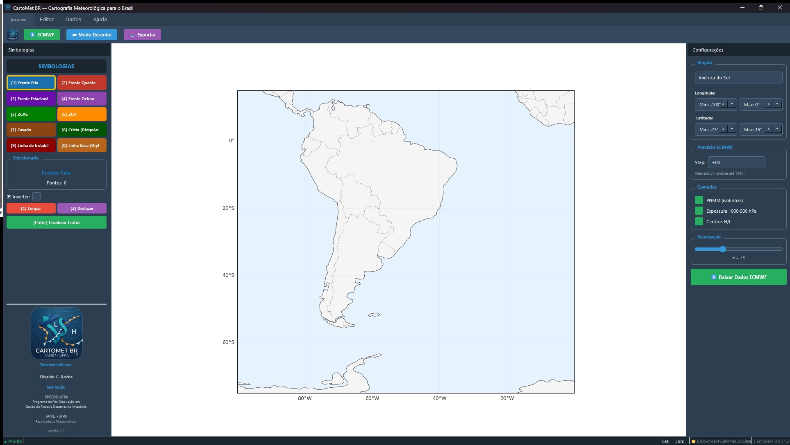
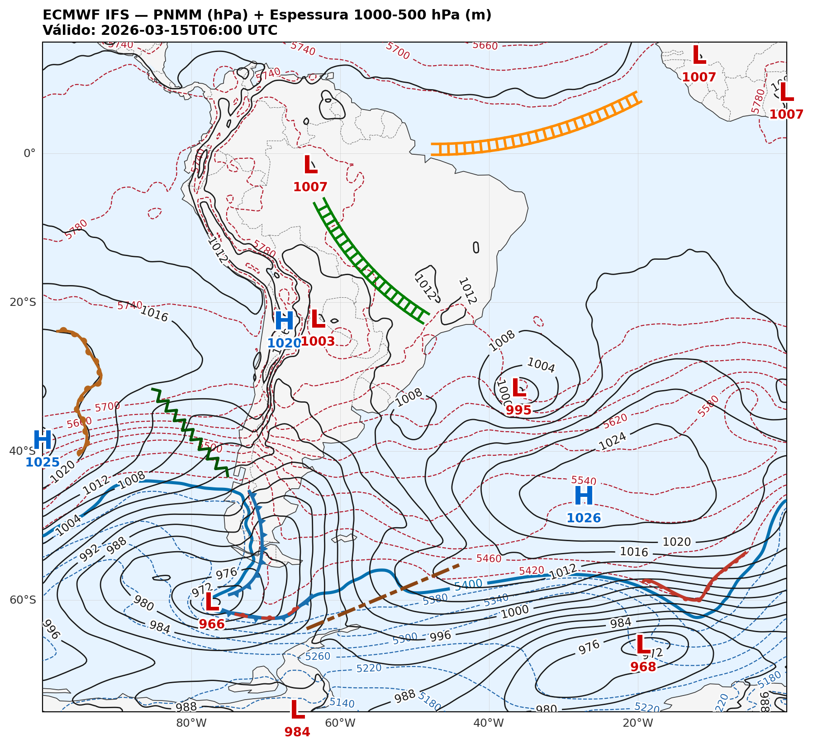

  

<h1 align="center">CartoMet BR</h1>

  <strong>Cartografia Meteorológica para o Brasil</strong>

  <a href="#-sobre">Sobre</a> •
  <a href="#-vídeo-demonstrativo">Vídeo</a> •
  <a href="#-funcionalidades">Funcionalidades</a> •
  <a href="#-download">Download</a> •
  <a href="#-instalação">Instalação</a> •
  <a href="#-documentação">Documentação</a> •
  <a href="#-autor">Autor</a>

  
  
  
  

---

## 📖 Sobre

O **CartoMet BR** é uma ferramenta profissional de cartografia meteorológica desenvolvida especificamente para **análise sinótica** no Brasil e América do Sul. O software permite visualizar campos meteorológicos do modelo **ECMWF IFS** e desenhar simbologias padronizadas como frentes, zonas de convergência e linhas de instabilidade.

### 🎯 Motivação

Este software foi desenvolvido como um **presente e expressão de gratidão** às instituições de origem e formação do autor:

- **PPGGRD-UFPA** — Programa de Pós-Graduação em Gestão de Riscos e Desastres na Amazônia
- **FAMET-UFPA** — Faculdade de Meteorologia

O objetivo é oferecer uma ferramenta gratuita que possa ser utilizada em **sala de aula**, auxiliando no ensino de análise sinótica e meteorologia, e também por **profissionais** em suas atividades operacionais de previsão do tempo.

---

## 🎬 Vídeo Demonstrativo

  

  

  <em>🎧 Vídeo gerado com NotebookLM — Uma visão geral do CartoMet BR e suas funcionalidades</em>

---

## ✨ Funcionalidades

| Recurso | Descrição |
|---------|-----------|
| 🌐 **Dados ECMWF** | Download automático de dados gratuitos do modelo IFS (resolução 0.25°) |
| 📊 **Campos Meteorológicos** | PNMM (Pressão ao Nível do Mar), Espessura 1000-500 hPa, Centros H/L |
| ✏️ **10 Simbologias** | Frentes (fria, quente, estacionária, oclusa), ZCAS, ZCIT, Cavado, Crista, Linha de Instabilidade, Linha Seca |
| 🗺️ **Regiões Predefinidas** | América do Sul, Brasil, Nordeste, Sudeste, Sul |
| 💾 **Exportação** | Salve cartas em PNG, JPEG ou PDF com 200 DPI |
| ⌨️ **Atalhos de Teclado** | Produtividade com atalhos para todas as simbologias |
| 🎨 **Interface Moderna** | Design escuro profissional com PyQt6 |

---

## 📥 Download

### Versão Atual: 1.2.2

| Arquivo | Descrição | Download |
|---------|-----------|----------|
| **Instalador_CartoMet_BR_v1.2.exe** | Instalador completo para Windows | [⬇️ Download](https://github.com/ElivaldoRocha/CartoMet_BR/releases/latest/download/Instalador_CartoMet_BR_v1.2.exe) |
| **CartoMet_BR_Manual_Usuario.pdf** | Manual do usuário ilustrado | [📄 Download](https://github.com/ElivaldoRocha/CartoMet_BR/releases/latest/download/CartoMet_BR_Manual_Usuario.pdf) |

> 💡 **Dica:** Baixe também o manual para aprender todas as funcionalidades do programa.

---

## 🚀 Instalação

### Método 1: Instalador (Recomendado)

1. Baixe o arquivo `Instalador_CartoMet_BR_v1.2.exe`
2. Execute o instalador e siga as instruções
3. O programa será instalado em `C:\Program Files\CartoMet_BR`
4. Um atalho será criado no Menu Iniciar

### Método 2: Portátil

Se preferir usar sem instalar:
1. Baixe o arquivo ZIP da versão portátil (se disponível)
2. Extraia para uma pasta de sua preferência
3. Execute `CartoMet_BR.exe`

### Primeira Execução

Na primeira execução, o programa solicitará que você escolha um **diretório de dados**. Este é o local onde os arquivos meteorológicos baixados do ECMWF serão armazenados.

> ⚠️ **Recomendação:** Escolha uma pasta dentro de "Documentos", como `Documentos/CartoMet_BR_Data`. Evite pastas do sistema.

---

## 💻 Requisitos

| Requisito | Mínimo | Recomendado |
|-----------|--------|-------------|
| **Sistema Operacional** | Windows 10 (64-bit) | Windows 11 (64-bit) |
| **Memória RAM** | 4 GB | 8 GB |
| **Espaço em Disco** | 500 MB | 1 GB+ (para dados) |
| **Conexão** | Internet para download ECMWF | Banda larga |

---

## 📸 Screenshots

  
   
  <em>Interface principal do CartoMet BR</em>

  
   
  <em>Exemplo de carta sinótica com ZCAS, ZCIT e frentes</em>

---

## 📚 Documentação

O manual completo do usuário está disponível em PDF e inclui:

- ✅ Guia de instalação passo a passo
- ✅ Descrição detalhada da interface
- ✅ Tutorial de uso com imagens
- ✅ Referência de todas as simbologias
- ✅ Tabela de atalhos de teclado
- ✅ Solução de problemas comuns

📄 **[Baixar Manual do Usuário (PDF)](https://github.com/ElivaldoRocha/CartoMet_BR/releases/latest/download/CartoMet_BR_Manual_Usuario.pdf)**

---

## ⌨️ Atalhos de Teclado

| Tecla | Ação |
|-------|------|
| `1` | Frente Fria |
| `2` | Frente Quente |
| `3` | Frente Estacionária |
| `4` | Frente Oclusa |
| `5` | ZCAS |
| `6` | ZCIT |
| `7` | Cavado |
| `8` | Crista |
| `9` | Linha de Instabilidade |
| `0` | Linha Seca |
| `F` | Inverter símbolos |
| `Enter` | Finalizar linha |
| `Z` | Desfazer ponto |
| `C` | Limpar tudo |

---

## 🛠️ Tecnologias

O CartoMet BR foi desenvolvido com as seguintes tecnologias:

- **Python 3.12** — Linguagem de programação
- **PyQt6** — Interface gráfica
- **Matplotlib** — Visualização de dados
- **Cartopy** — Projeções cartográficas
- **xarray** — Manipulação de dados multidimensionais
- **MetPy** — Processamento meteorológico
- **ECMWF Open Data** — Fonte de dados meteorológicos

---

## 👤 Autor

  <strong>Elivaldo C. Rocha</strong>

  Mestre pelo PPGGRD-UFPA 
  Bacharel em Meteorologia pela FAMET-UFPA 
  Graduando em Análise e Desenvolvimento de Sistemas

  
  

---

## 🏛️ Instituições

  <strong>PPGGRD-UFPA</strong> 
  Programa de Pós-Graduação em Gestão de Riscos e Desastres na Amazônia  
  <strong>FAMET-UFPA</strong> 
  Faculdade de Meteorologia  
  <strong>Universidade Federal do Pará</strong>

---

## 📄 Licença

Este projeto está sob a licença MIT. Veja o arquivo [LICENSE](LICENSE) para mais detalhes.

---

## 🙏 Agradecimentos

- **ECMWF** — Por disponibilizar dados meteorológicos gratuitamente através do Open Data
- **Comunidade Python** — Pelas excelentes bibliotecas científicas
- **PPGGRD-UFPA e FAMET-UFPA** — Pela formação acadêmica e inspiração

---

  <strong>CartoMet BR</strong> — Uma ferramenta para sala de aula e para profissionais da meteorologia.

  Desenvolvido com ❤️ por Elivaldo C. Rocha

  Dados: ECMWF Open Data (CC BY 4.0)

