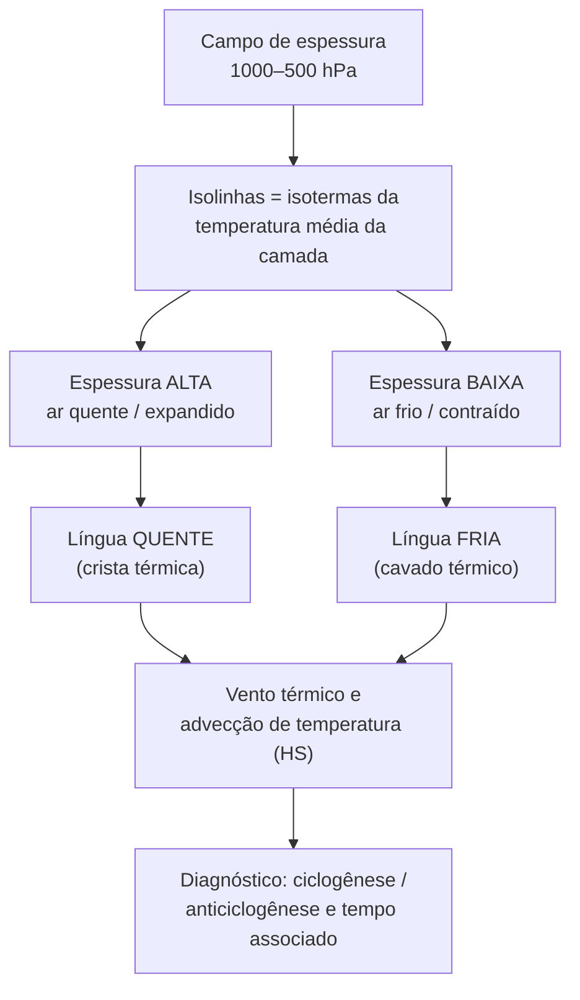

# Material de Estudo — Espessura da Camada 1000–500 hPa

> Guia didático do **CartoMet BR**. Objetivo: interpretar a **espessura geopotencial** da camada
> 1000–500 hPa nas cartas sinóticas da América do Sul — língua quente e língua fria, vento térmico,
> advecção de temperatura — e conectar isso com as **isóbaras de PNMM** (cavado, crista e o tempo
> associado). Todas as regras de giro do vento estão escritas para o **Hemisfério Sul (HS)**.

---

## Sumário

---

## 1. O que é a espessura de uma camada

A **espessura geopotencial** $\Delta Z$ é a distância vertical entre duas superfícies isobáricas — no
nosso caso, entre a de 1000 hPa e a de 500 hPa. Ela sai da **equação hipsométrica**, que combina o
equilíbrio hidrostático com a lei dos gases ideais:

$$
\Delta Z = Z_{500} - Z_{1000} = \frac{R_d\,\overline{T_v}}{g}\,\ln\!\left(\frac{1000}{500}\right)
$$

onde $R_d$ é a constante do ar seco, $g$ a gravidade e $\overline{T_v}$ a **temperatura virtual média**
da camada. A temperatura virtual apenas corrige a densidade pela umidade — ar úmido é mais leve que ar
seco à mesma temperatura:

$$
T_v \approx T\,(1 + 0{,}61\,q)
$$

com $q$ a umidade específica.

**A consequência é toda a razão de usar espessura:** como a razão de pressões $\ln(1000/500)$ é
**constante**, a espessura passa a depender **apenas da temperatura média da coluna**:

$$
\boxed{\;\Delta Z \;\propto\; \overline{T_v}\;}
$$

> **Ideia-chave.** As linhas de espessura (isoespessuras) funcionam como **isotermas da temperatura
> média** da baixa e média troposfera. Quem lê espessura está lendo temperatura integrada da camada —
> sem depender de um único nível.

---

## 2. Interpretação básica: quente expande, frio contrai

| Espessura | Temperatura média da camada | Estado do ar | Massa de ar típica |
|:--|:--|:--|:--|
| **Alta** (ex.: $> 5700$ m) | Quente | Coluna **expandida** | Tropical / subtropical |
| **Baixa** (ex.: $< 5400$ m) | Fria | Coluna **contraída** | Polar / antártica |

O ar quente é menos denso: a mesma diferença de pressão (1000→500 hPa) ocupa **mais** metros na
vertical, logo **maior espessura**. O ar frio é denso e a camada **encolhe**. Por isso um avanço de ar
frio polar aparece na carta como uma **queda** dos valores de espessura sobre o continente.

---

## 3. Língua quente (crista térmica) × língua fria (cavado térmico)

Quando as isoespessuras se **ondulam**, elas revelam a estrutura térmica — do mesmo modo que cavados e
cristas em cartas de altura revelam a estrutura dinâmica.

- **Língua quente / crista térmica** — uma protuberância de **valores altos** de espessura apontando
  para os **polos** (para o sul, no HS). Indica **advecção de ar quente** empurrando em direção a
  latitudes mais altas. Costuma aparecer **à frente (leste)** de um ciclone, no setor de escoamento de
  norte/noroeste.
- **Língua fria / cavado térmico** — uma reentrância de **valores baixos** de espessura apontando para
  o **equador** (para o norte, no HS). Indica **advecção de ar frio** avançando para latitudes baixas.
  Costuma aparecer **na retaguarda (oeste)** de um ciclone, atrás de um sistema frontal, no escoamento
  de sul/sudoeste.

> **Como identificar rápido:** siga uma isoespessura destacada (a de 5400 m é ótima âncora). Onde ela
> **mergulha para o equador**, há língua fria; onde ela **avança para o polo**, há língua quente. A
> amplitude da onda mede a intensidade da baroclinia (contraste térmico) naquela região.

---

## 4. Vento térmico e advecção de temperatura — regras do HS

O **vento térmico** $\vec{V_T}$ **não é um vento real**: é a *diferença* entre o vento geostrófico do
topo e o da base da camada. Ele sopra **paralelo às isoespessuras** (com o ar frio de um lado e o
quente do outro), e sua intensidade é proporcional ao **gradiente de espessura**. Ele explica por que o
vento **gira com a altura** numa atmosfera baroclínica.

### 4.1. A orientação (atenção: HS é o inverso do HN)

$$
\vec{V_T} = \vec{V_g}(500) - \vec{V_g}(1000)
$$

| | **Hemisfério Sul (HS)** | Hemisfério Norte (HN) |
|:--|:--|:--|
| Vetor vento térmico $\vec{V_T}$ | Sopra deixando o **ar quente à esquerda** e o frio à direita | Ar **frio à esquerda**, quente à direita |
| **Giro horário** com a altura | **Advecção FRIA** → subsidência, anticiclogênese | Advecção quente |
| **Giro anti-horário** com a altura | **Advecção QUENTE** → ascensão, ciclogênese | Advecção fria |

> **Regra de bolso para o Brasil (HS):** observe como a direção do vento muda da superfície para os
> níveis médios num mesmo ponto (sondagem ou perfil do modelo).
> - Vento **girando no sentido horário** com a altura → **advecção fria** (pós-frontal, ar polar
>   entrando, pressão subindo).
> - Vento **girando no sentido anti-horário** com a altura → **advecção quente** (vanguarda, ar quente
>   sendo puxado para o sul, pressão caindo).
>
> É **exatamente o oposto** das regras "veering/backing" dos livros do Hemisfério Norte. Não misture.

### 4.2. Por que isso importa (Lindzen & Nigam; Sutcliffe)

O **gradiente térmico** — não a temperatura absoluta — é que força os gradientes de pressão e a
convergência na baixa troposfera. E a **advecção de espessura** (advecção térmica) é um dos motores da
ciclogênese: máximo de advecção quente à frente de um sistema → divergência em altos níveis → **queda
de pressão à superfície** (ciclogênese); máximo de advecção fria na retaguarda → **aumento de pressão**
(anticiclogênese, fortalecimento do anticiclone pós-frontal frio).

---

## 5. A isoespessura de 5400 m e a previsão de neve no Sul

Globalmente, a isolinha de **5400 m** é a referência clássica para o **limite chuva–neve** (a
temperatura média da camada perto de $0\,^\circ$C). Mas o limiar **não** é universal:

- **Regra global:** $\approx 5400$ m ≈ 50% de probabilidade de neve ao nível do mar.
- **Sul do Brasil (Weber & Nascimento, 2011):** eventos de neve nas serras gaúcha/catarinense ocorrem
  com espessura mais **alta**, em torno de **5340 m** (faixa ~5320–5360 m), por causa da altitude das
  serras e da umidade de origem marítima.

Para refinar, usam-se **espessuras parciais** ("regra dos três terços"): a camada grande (1000–500)
pode esconder uma fina camada quente perto do solo que derrete o floco. Verificam-se então subcamadas:

| Camada | Foco do diagnóstico |
|:--|:--|
| **1000–850 hPa** | Ar junto à superfície frio o bastante (evita fusão no solo) |
| **1000–700 hPa** | Baixa troposfera integrada; evita falso alarme de neve |
| **850–500 hPa** | Profundidade e suporte térmico da massa fria em níveis médios |

> **Contexto sul-americano:** a alta pressão fria continental que avança logo ao sul do Uruguai/Argentina,
> **abaixo da linha de 5400 m**, é a assinatura típica de um **anticiclone migratório pós-frontal de
> núcleo frio** — pulso polar/antártico que derruba temperaturas e favorece geadas.

---

## 6. Isóbaras de PNMM: cavado, crista e o tempo associado

A **Pressão ao Nível Médio do Mar (PNMM)** é traçada em **isóbaras**. A curvatura delas define os dois
padrões que orientam o tempo:

- **Cavado (baixa pressão alongada):** isóbaras curvadas formando um "vale" de pressão, ciclonicamente
  (no HS, giro **horário** ao redor da baixa). Eixo do cavado = linha que une os pontos de menor pressão.
- **Crista (alta pressão alongada):** isóbaras curvadas formando um "morro" de pressão,
  anticiclonicamente (no HS, giro **anti-horário** ao redor da alta). Ar subsidente, tempo estável.

### 6.1. Onde está o tempo? A leste do cavado

Nas latitudes médias do HS o escoamento é predominantemente de **oeste** (as correntes de oeste), então
os sistemas se movem de **oeste para leste**. Isso define o tempo associado:

| Setor do cavado | Escoamento | Movimento vertical | Tempo |
|:--|:--|:--|:--|
| **Leste (dianteira)** | Norte/noroeste, **advecção quente** | **Ascendente** | Nebulosidade, instabilidade, **chuva** |
| **Oeste (retaguarda)** | Sul/sudoeste, **advecção fria** | **Subsidente** | Céu limpando, ar frio e seco, **melhora** |

> **Regra de bolso:** **a leste (à frente) do cavado o tempo piora**; a oeste (atrás) melhora. Sobrepor
> o campo de espessura ajuda: a **língua quente** (advecção quente) costuma coincidir com o setor
> dianteiro chuvoso; a **língua fria** (advecção fria), com a retaguarda que estabiliza.

### 6.2. Casando espessura + PNMM na prática

1. Localize os cavados/cristas nas **isóbaras de PNMM** (onde está a baixa e a alta).
2. Sobreponha a **espessura**: identifique língua quente (para o polo) e língua fria (para o equador).
3. Confira o **defasamento** entre o cavado de pressão e o cavado térmico — quando o cavado térmico
   está **atrás (oeste)** do cavado de pressão, o sistema tende a **se intensificar** (ciclogênese
   ativa, advecção quente forte na dianteira).
4. Traduza em tempo: dianteira do cavado (leste) = chuva/instabilidade; retaguarda (oeste) = melhora e
   entrada de ar frio.

---

## 7. Regras de bolso (síntese)

- **Espessura = termômetro da camada.** Alta → quente/expandida; baixa → fria/contraída.
- **Língua para o polo = quente; língua para o equador = fria** (no HS, polo = sul).
- **Giro do vento com a altura (HS):** horário → **advecção fria**; anti-horário → **advecção quente**.
  (Inverso do HN.)
- **5400 m** = limite chuva–neve global; no **Sul do Brasil use ~5340 m** e confira espessuras parciais.
- **Tempo a leste do cavado** (dianteira) = instabilidade/chuva; a oeste = melhora.
- **Advecção quente à frente** de um sistema → queda de pressão / ciclogênese; **advecção fria atrás**
  → aumento de pressão / anticiclone frio pós-frontal.

---

## Referências

- LINDZEN, R. S.; NIGAM, S. On the role of sea surface temperature gradients in forcing low-level winds
  and convergence in the tropics. *J. Atmos. Sci.*, v. 44, n. 17, p. 2418–2436, 1987.
- WEBER, C.; NASCIMENTO, E. L. Eventos de neve no Sul do Brasil e a espessura da camada 1000–500 hPa.
  *(análise sinótica regional)*, 2011.
- HOLTON, J. R.; HAKIM, G. J. *An Introduction to Dynamic Meteorology*. 5. ed. — vento térmico e
  advecção de espessura.
- SATYAMURTY, P. *Rudimentos de Meteorologia Dinâmica* — desenvolvimento de ciclones (equação de
  tendência de vorticidade / Sutcliffe).

---

*Material de apoio do CartoMet BR. Acompanha o produto de espessura 1000–500 hPa e a análise de PNMM
(letras H/L). As convenções de giro do vento e de língua quente/fria seguem o Hemisfério Sul.*
