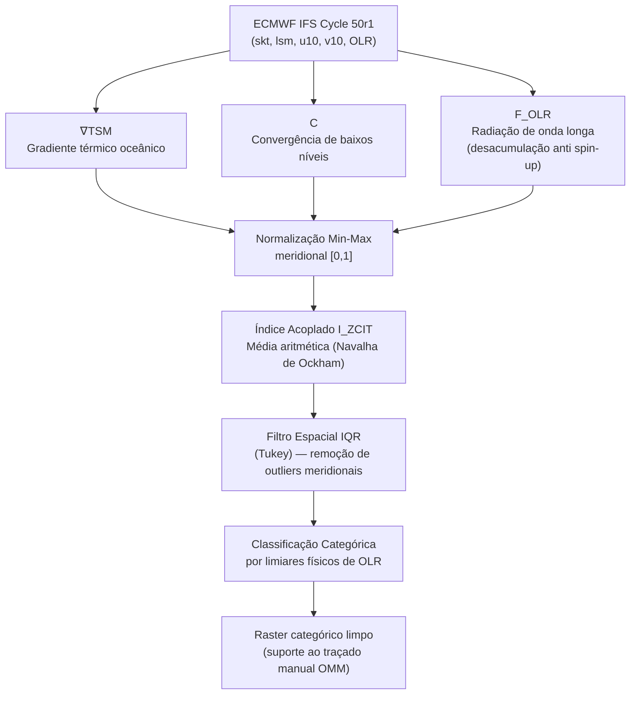

# Metodologia Científica — Índice Integrado LOCZCIT-PA (Potencial Acoplado)

> **Módulo de Localização da Zona de Convergência Intertropical — versão Potencial Acoplado.**
> Documentação técnica oficial do **CartoMet BR v3.0**.
> Forçantes extraídas do modelo **ECMWF IFS Cycle 50r1**.

---

## Sumário do Pipeline

---

## 1. Filosofia Operacional e Suporte à Decisão (*Human-in-the-loop*)

Diferentemente de algoritmos de detecção totalmente automatizados que **excluem o previsor** do processo decisório, o Índice Integrado **LOCZCIT-PA** atua como um **campo avançado de suporte à decisão**. A premissa é fundir o processamento de alto desempenho de tensores multidimensionais com a capacidade cognitiva e a experiência sinótica do meteorologista.

O algoritmo **não traça a carta final**. Ele **quantifica e espacializa a probabilidade física da convecção**, gerando um mapa matricial categorizado (*Raster*) que orienta o traçado manual das simbologias meteorológicas padronizadas pela **Organização Meteorológica Mundial (OMM)**.

---

## 2. O Modelo Físico Acoplado (A Tríade Termodinâmica-Cinemática)

A Zona de Convergência Intertropical (ZCIT) é a manifestação termodinâmica do **ramo ascendente da Célula de Hadley** sobre os oceanos equatoriais. Para evitar a detecção espúria de sistemas transientes que adentram os trópicos — como Vórtices Ciclônicos de Altos Níveis (VCAN) ou sistemas frontais em dissipação —, o índice exige o **alinhamento espacial simultâneo** de três forçantes fundamentais.

### 2.1. Forçante de Fronteira Térmica ($\nabla \text{TSM}$)

A magnitude do gradiente da Temperatura da Superfície do Mar:

$$
\nabla \text{TSM} = \sqrt{\left( \frac{\partial T_s}{\partial x} \right)^2 + \left( \frac{\partial T_s}{\partial y} \right)^2}
$$

onde $T_s$ representa o campo escalar da Temperatura de Pele (*Skin Temperature*, `skt`).

Calculado **exclusivamente sobre o oceano** (mediante a máscara de terra-mar `lsm` aplicada sobre a variável de temperatura de pele `skt`), este parâmetro rastreia os desequilíbrios térmicos superficiais. Conforme a dinâmica de fluidos na camada limite equatorial (**Lindzen e Nigam, 1987**), é o **gradiente térmico** — e não a temperatura absoluta — que impõe os gradientes de pressão responsáveis por forçar a convergência do fluxo de massa.

#### 2.1.1. Justificativa do uso da Temperatura de Pele (*Skin Temperature*, `skt`) como proxy de TSM

A escolha da variável `skt` em lugar da Temperatura da Superfície do Mar estrutural (*Bulk SST*) é sustentada por **dois pilares convergentes**: um físico-termodinâmico e um operacional.

**(a) Justificativa Física — a atmosfera "sente" apenas a pele do oceano.**

Existe uma distinção crucial entre duas grandezas frequentemente tratadas como sinônimos:

- **Bulk SST:** a temperatura da água estrutural, medida por boias entre $1$ e $5\ \text{m}$ de profundidade.
- **Skin SST (`skt`):** a temperatura da camada **micrométrica** exata, na interface oceano-atmosfera.

A troca turbulenta de calor sensível e latente, bem como a emissão radiativa que alimenta a convecção, ocorre **estritamente nessa película**. A atmosfera **não interage termodinamicamente com a água profunda** — ela responde à pele. Na região equatorial, berço da ZCIT, caracterizada por forte insolação e ventos alísios frequentemente brandos (zona de calmarias, *doldrums*), a *Skin SST* sofre um **ciclo diurno agressivo**, podendo aquecer de $1\ ^\circ\text{C}$ a $3\ ^\circ\text{C}$ acima da água logo abaixo.

Ao extrair a `skt` do **IFS Cycle 50r1** — que resolve essa camada milimétrica por meio do modelo oceânico acoplado **NEMO4-SI³** — e aplicar a máscara `lsm`, garante-se que o gradiente $\nabla \text{TSM}$ represente o desequilíbrio térmico **real e instantâneo** que está forçando o escoamento naquela hora sinótica exata, e não uma média diária estática que mascara o forçamento de pele.

> **Analogia:** medir a *Bulk SST* para prever a convecção é como medir a temperatura no fundo de uma xícara de café para saber quanto vapor sobe da superfície. O ar só conversa com a primeira fração de milímetro — é a pele que dita o fluxo.

Referências de sustentação: **Donlon et al. (2002)** demonstram que a pele reage quase instantaneamente à radiação solar e difere da *Bulk SST*, sendo a verdadeira interface de fluxo; **Fairall et al. (1996)** estabelecem o algoritmo TOGA COARE — padrão-ouro para fluxos tropicais — que exige a modelagem do aquecimento diurno da camada de pele; e **Lindzen e Nigam (1987)** provam que os gradientes de pressão na camada limite equatorial são ditados diretamente pelos gradientes da TSM.

**(b) Justificativa Operacional — disponibilidade nos dados abertos do ECMWF.**

A Temperatura da Superfície do Mar estrutural (*Bulk SST*) **não integra o conjunto gratuito** do *ECMWF Open Data* — seu acesso depende de licenciamento pago. A variável `skt` (*skin temperature*), por outro lado, está **livremente disponível** no fluxo aberto do IFS. Logo, a escolha por `skt` é **duplamente blindada**: a física aponta a pele como a interface termodinamicamente correta, e a realidade do dado aberto torna a `skt` a variável **acessível e reprodutível** para uma ferramenta operacional como o CartoMet BR — preservando o caráter livre e de baixo custo computacional herdado da filosofia LOCZCIT original (**Rocha, 2022**; **Ferreira et al., 2005**).

> **Ressalva honesta e mitigação da DWL.** Revisões científicas independentes registram que a `skt` não é, isoladamente, a variável *ideal* para um **gradiente**: ela carrega o sinal da **Camada Quente Diurna** (*Diurnal Warm Layer*, DWL), uma assinatura **espacialmente variável e dependente da hora do dia** que injeta ruído no $\nabla \text{TSM}$. A *bulk/foundation SST* (`sst`, paramId 34) seria fisicamente preferível, mas está **ausente da stream `oper`** do ECMWF Open Data mesmo após o Ciclo 50r1 — daí a `skt` (paramId 235) ser a opção **disponível e gratuita**, não a ótima. O artefato da DWL é mitigado por: **(i)** uma **suavização Gaussiana ciente-de-NaN** do campo de `skt` **sobre o oceano**, aplicada **antes** da derivação (parâmetro calibrável `SKT_SMOOTH_SIGMA`; como o continente é mascarado *antes* de suavizar, a costa não é contaminada — preserva a Blindagem #1); e **(ii)** a recomendação operacional de privilegiar rodadas de **validade matutina** (~$06$–$09\ \text{h}$ local), quando a película já resfriou e a `skt` se aproxima da temperatura estrutural — preservando o forçamento de *back-pressure* hidrostático de **Lindzen e Nigam (1987)**. Referências de sustentação: **Donlon et al. (2002)**; **Zeng e Beljaars (2005)**.

### 2.2. Cinemática de Baixos Níveis ($C$)

A convergência horizontal do campo de vento a 10 metros:

$$
C = -\left( \frac{\partial u}{\partial x} + \frac{\partial v}{\partial y} \right)
$$

Esta componente cinemática delimita fisicamente o **eixo de encontro dos ventos alísios** de Nordeste e Sudeste, configurando a ascensão mecânica. O sinal negativo garante que valores positivos de $C$ correspondam à **convergência** (divergência $< 0$).

### 2.3. Assinatura Termodinâmica ($F_{OLR}$)

O fluxo instantâneo de Radiação de Onda Longa Emergente (*Outgoing Longwave Radiation*), em $W/m^2$. Para extrair esta componente, aplica-se a técnica de **mitigação de *spin-up***: o motor **descarta as $6$–$9\ \text{h}$ iniciais de integração** (período de *spin-up*) e isola o fluxo radiativo instantâneo de uma **janela já estabilizada da rodada-base madura**, desacumulando **dois *steps* consecutivos da mesma rodada** (`ttr` em $J/m^2$, dividido pelo $\Delta t$ em segundos):

$$
F_{OLR}(t) = \frac{A_{OLR}(t) - A_{OLR}(t - \Delta t)}{\Delta t}
$$

onde $A_{OLR}$ é o campo radiativo **acumulado** entregue pelo modelo. Isso garante que o fluxo medido reflita estritamente a presença de **sistemas convectivos profundos (Cumulonimbus)** já estabilizados pelas equações de microfísica de nuvens do modelo numérico, e não artefatos de inicialização.

> **Por que a desacumulação importa?** Ao assimilar dados reais no instante da análise (*step* $=0$), o modelo cria um desequilíbrio inicial entre os campos dinâmicos (vento, massa) e as parametrizações de microfísica e convecção. Nas primeiras $3$ a $6$ horas de integração — o período de ***spin-up*** — o modelo subestima ou injeta ruído excessivo em precipitação e nebulosidade até que as correntes ascendentes atinjam equilíbrio termodinâmico (**Kalnay, 2003**; **Illari, 1987**). Como a OLR é fornecida **acumulada** (em $J/m^2$ desde o *step* $=0$), usar os primeiros passos significaria "engolir" todo esse ruído. Isolar uma janela madura (e.g., subtrair o acumulado do *step* $=9$ do *step* $=12$) e dividir pelo intervalo em segundos extrai um fluxo instantâneo limpo em $W/m^2$ — condição necessária para que os limiares de OLR consagrados (**Gadgil e Guruprasad, 1990**) não sejam contaminados por cirrus espúrios de inicialização.

---

## 3. Normalização Meridional Dinâmica

Como as matrizes expressam grandezas **incomensuráveis** (Graus Celsius por distância, inverso de segundos e Watts por metro quadrado), aplica-se uma normalização **Min-Max escalar** para o intervalo adimensional $[0, 1]$:

$$
\widehat{X}_{j} = \frac{X_{j} - \min(X_{j})}{\max(X_{j}) - \min(X_{j})}
$$

Para **preservar a continuidade da banda da ZCIT** ao longo de toda a bacia oceânica, a normalização é executada **meridionalmente (coluna por coluna, índice $j$)**. Esta restrição impede que a assinatura de sistemas convectivos explosivamente anômalos no **Atlântico Oeste** achate estatisticamente a detecção da ZCIT no **Atlântico Leste**.

> **Consequência interpretativa.** Como cada meridiano é reescalado de forma independente, o $I_{ZCIT}$ realça, **em cada longitude**, a latitude de **maior acoplamento relativo** entre as três forçantes — e **não** um ápice comparável em valor absoluto entre meridianos distintos. Por construção, é um **realce relativo por longitude**: comparar o valor numérico de $I_{ZCIT}$ entre colunas diferentes não é fisicamente significativo; o que importa, em cada meridiano, é *onde* o acoplamento se concentra.

### Inversão termodinâmica da OLR

Na OLR, a lógica termodinâmica impõe que **topos de nuvens mais frios e profundos emitam menor radiação**. Portanto, seu sinal normalizado é matematicamente **invertido**:

$$
\widehat{F_{OLR}}^{\,*} = 1 - \widehat{F_{OLR}}
$$

assegurando que **alta convergência, alto gradiente térmico e alta nebulosidade** caminhem positivamente em direção ao valor $1$.

---

## 4. A Equação do Índice, Parcimônia e a Navalha de Ockham

A modelagem de um índice multivariável levanta o desafio da **atribuição de pesos** a cada componente. A introdução de coeficientes empíricos desiguais (por exemplo, atribuir 40% de importância à convergência e 30% à OLR) configuraria a inserção de *"números mágicos"* ou premissas arbitrárias na equação.

Para justificar cientificamente pesos desiguais na escala sinótica, seria **imperativa** a execução de uma calibração estatística multidecadal exaustiva — como uma **Análise de Componentes Principais (PCA)** ou a extração de **Funções Ortogonais Empíricas (EOF)** sobre uma base de reanálises climáticas (e.g., ERA5) de pelo menos **30 anos**. Apenas uma análise de variância de longo prazo poderia provar matematicamente se uma forçante explica uma porcentagem maior do comportamento da ZCIT do que as demais.

Na ausência de tal calibração específica, e fundamentando-se na **lei de conservação do sistema acoplado** (onde a forçante térmica, a cinemática e a termodinâmica são pilares mutuamente dependentes para a manutenção da ZCIT), adota-se o **Princípio da Parcimônia (Navalha de Ockham)**: a explicação mais simples, com o menor número de premissas não comprovadas, deve ser a escolhida.

Mais do que parcimônia, a escolha de **pesos idênticos é estatisticamente fundamentada**. **Dawes (1979)** — *"The robust beauty of improper linear models in decision making"* — demonstra que modelos de **pesos unitários** frequentemente **igualam ou superam** modelos de pesos otimizados *fora da amostra*, por **reduzirem a variância de erro** dos próprios coeficientes e evitarem o *overfitting* que aflige calibrações como EOF/PCA quando a base de reanálise é curta ou não-estacionária. Como as três forçantes são **previamente normalizadas a $[0,1]$**, a média aritmética opera sobre escalas comparáveis — condição que torna o argumento de Dawes diretamente aplicável aqui.

Logo, assume-se **peso idêntico** para os três processos geofísicos, resultando em uma **média aritmética rigorosa**:

$$
\boxed{\;I_{ZCIT} = \frac{1}{3}\left( \widehat{\nabla \text{TSM}} + \widehat{C} + \widehat{F_{OLR}}^{\,*} \right)\;}
$$

onde $\widehat{F_{OLR}}^{\,*} = 1 - \widehat{F_{OLR}}$ é o sinal radiativo normalizado e **invertido** introduzido na Seção 3.

A matriz resultante $I_{ZCIT} \in [0, 1]$ representa o **Potencial de Acoplamento físico** (daí o sufixo **PA**): em cada meridiano, valores próximos a $1$ destacam a latitude onde gradiente térmico, convergência mecânica e nebulosidade profunda **mais coexistem espacialmente** — a assinatura da ZCIT. Como visto na Seção 3, esse realce é **relativo por longitude**: não se comparam valores absolutos de $I_{ZCIT}$ entre meridianos distintos.

> **Ressalva (sem alegar superioridade absoluta).** Pesos iguais trocam uma eventual perda marginal de aderência amostral por **robustez e transparência**; **não se afirma** que superem uma calibração EOF/PCA bem-condicionada, apenas que são **mais seguros na ausência dela** (Dawes, 1979).

---

## 5. O Filtro Espacial LOCZCIT-PA via Intervalo Interquartil (IQR)

A matriz do $I_{ZCIT}$ mapeia a probabilidade de acoplamento físico. Contudo, o rastreio simples dos valores máximos incorporaria **ruídos** oriundos da migração pendular meridional e de perturbações transientes, como os **Distúrbios Ondulatórios de Leste (DOL)** (**Rocha, 2022**).

Para mitigar este artefato, o algoritmo identifica a **latitude de máxima energia em cada meridiano** e aplica sobre esta série unidimensional o método **não paramétrico do Intervalo Interquartil (IQR)** de Tukey. Este estágio é a **herança metodológica validada** do índice progenitor **LOCZCIT-IQR** (**Rocha, 2022**), no qual a filtragem estatística por IQR já demonstrou capacidade objetiva de isolar coordenadas associadas a DOL e a sistemas transientes do eixo central da ZCIT, alimentando posteriormente a interpolação por *B-splines*. Calculam-se os quartis $Q_1$ e $Q_3$ e a amplitude:

$$
IQR = Q_3 - Q_1
$$

Estabelecem-se os limites de corte (*Tukey fences*):

$$
LI = Q_1 - 1{,}5 \cdot IQR
\qquad\qquad
LS = Q_3 + 1{,}5 \cdot IQR
$$

Latitudes $y$ que **extrapolam** a condição $LI \le y \le LS$ são sumarizadas como **outliers espaciais** e convertidas em valores nulos (`NaN`) na matriz final.

Esse isolamento estatístico **blinda a detecção**, garantindo que as manchas resultantes pertençam exclusivamente ao **eixo central e contínuo** da ZCIT, e não a sistemas convectivos órfãos que migraram para latitudes anômalas.

### 5.1. Ressalva ao IQR e a alternativa de Coerência Espacial (LISA / Moran Local)

O filtro IQR é robusto e barato, mas tem um limite **fisicamente relevante**: os **Distúrbios Ondulatórios de Leste (DOL)** e os **Vórtices Ciclônicos de Altos Níveis (VCAN) de larga escala** **não são *outliers* estatísticos independentes** — são sistemas **dinamicamente acoplados** à ZCIT, que frequentemente **compartilham a mesma faixa de latitude**. Cercas de Tukey aplicadas à série de latitudes podem, portanto, **amputar excursões legítimas** da banda (e.g., os saltos meridionais documentados da migração para a costa do Pará/Nordeste), e não apenas remover sistemas contaminantes. Por isso o IQR **não deve** ser descrito como "remoção garantida de DOL/VCAN", e a **decisão final permanece visual e manual** (*human-in-the-loop*): o raster orienta, o meteorologista traça.

Como alternativa **opcional e fisicamente mais coerente**, o CartoMet BR v3.0 oferece um filtro de **Coerência Espacial** baseado em **Indicadores Locais de Associação Espacial (LISA)** — o **Moran Local** (**Anselin, 1995**). Em vez de perguntar *"esta latitude é um outlier?"*, ele pergunta *"este pixel de convecção está cercado por outros pixels de convecção, de forma estatisticamente significativa?"* — isolando o **envelope contíguo** da ZCIT e descartando células órfãs (VCAN isolado, ruído) **sem** amputar excursões legítimas da banda. O *pipeline* é:

1. **Suavização** Gaussiana do campo $I_{ZCIT}$ (dilui ruído residual);
2. **Vizinhança** da grade regular (contiguidade *Queen*, 8 vizinhos);
3. **Moran Local** com aleatorização condicional (*Monte Carlo*);
4. retenção dos *hotspots* **High-High** com **significância $p < 0{,}05$**;
5. **isolamento morfológico** — rotulagem de manchas contíguas, mantendo os aglomerados grandes (o envelope da ZCIT).

O método é **reprodutível** (semente fixa: o mesmo dado produz sempre a mesma máscara — essencial num produto operacional) e custa mais CPU/RAM (centenas de simulações). Permanece **opcional** (extra `spatial`); o IQR continua o **padrão rápido**. Ambos entregam a **mesma interface** ao restante do motor (uma máscara booleana → raster categórico), preservando o acoplamento (Ockham) e a classificação por OLR.

---

## 5.2. Máscara Ativa Acoplada e Envelope Sazonal (reformulação v3.0)

A revisão da metodologia (linhagem do *Projeto ZCIT_AXIS*, validada com reanálise ERA5 e operada com o IFS Open Data) introduz duas travas físicas **antes** da classificação, substituindo a antiga gating apenas-por-OLR:

**(a) Máscara ATIVA — a união que resgata o ramo sul.** Como a normalização meridional faz **toda** coluna ter máximo $1{,}0$ (inclusive céu limpo), **não** se pode limiarizar o $I_{ZCIT}$ para gerar a máscara. O portão é a **união física absoluta**:

$$
\text{ativo} = \text{oceano} \;\wedge\; \big( F_{OLR} < 240\;W/m^2 \;\vee\; C > C_{THR} \big), \qquad C_{THR} = 3\times10^{-5}\;s^{-1}
$$

Onde a OLR é cega mas a convergência é **organizada e genuína**, o pixel entra — **resgatando o ramo sul** da ZCIT, nítido no campo de convergência e quase invisível na OLR (**Liu e Xie, 2002**; **Berry e Reeder, 2014**). $C_{THR}$ é calibrado para selecionar convergência organizada, não o fundo fraco dos alísios de SE. A coerência espacial (aglomerados conexos $\ge$ `MIN_CLUSTER_PIXELS`) remove núcleos órfãos. O antigo IQR-de-latitude **não** é mais aplicado ao raster (ele assume banda única e amputaria justamente esse resgate); a herança IQR/Tukey permanece na detecção do **eixo** (§5.3).

**(b) Envelope sazonal de latitude.** Uma trava climatológica zera a máscara ativa fora da faixa física da ZCIT atlântica:

$$
\varphi_c(\text{doy}) = 5°N + 4{,}5°\cos\!\left(\frac{2\pi(\text{doy}-245)}{365{,}25}\right), \qquad \text{faixa } \varphi_c \pm 7{,}5°
$$

Ela rejeita transientes subtropicais (VCAN, DOL, plumas frontais — ex.: convecção espúria a $12°N$ em abril) **sem** clipar o ramo sul, pois a faixa desce até $\varphi_c - 7{,}5°$. É sazonal (acompanha a migração ao norte em set $\approx 9{,}5°N$), **não** uma gaiola fixa no equador (**Waliser e Gautier, 1993**; **Nobre e Shukla, 1996**).

## 5.3. Detecção do Eixo (overlay opcional)

Sobre o campo acoplado $I_{ZCIT}$ e a máscara ativa, o motor detecta um **eixo** (centroide meridional ponderado por intensidade — **Adam et al., 2016**; rejeição de *outliers* por IQR de Tukey em janela móvel; suavização **LOWESS** robusta — **Cleveland, 1979**), tratando **banda simples e dupla** (bimodalidade do perfil meridional, no espírito de Hartigan-Hartigan; nó de bifurcação onde os ramos divergem). É uma **camada de orientação opcional** (desligada por padrão): orienta, mas **quem traça a carta OMM é o meteorologista** (*human-in-the-loop*).

---

## 6. Classificação Categórica e Limiares Físicos de OLR

Os pixels que **sobrevivem à máscara ativa e ao envelope sazonal** são classificados **retroativamente** para fins de plotagem cartográfica. O valor categórico de cada pixel busca a *"Verdade Terrestre"* (*Ground Truth*) no valor **absoluto, não-normalizado**, do fluxo de OLR ($F_{OLR}$) daquele ponto, baseando-se em limiares consagrados na literatura meteorológica tropical.

| Categoria | Intensidade | Cor | Limiar de $F_{OLR}$ |
|:---------:|:------------|:---:|:--------------------|
| **3** | ZCIT Forte | 🔴 Vermelho Escuro | $F_{OLR} \le 180 \; W/m^2$ |
| **2** | ZCIT Moderada | 🟡 Amarelo | $180 < F_{OLR} \le 210 \; W/m^2$ |
| **1** | ZCIT Fraca | 🟢 Verde | $210 < F_{OLR} \le 240 \; W/m^2$ |
| **0** | ZCIT Cinemática | 🟣 Magenta | $F_{OLR} > 240 \; W/m^2$ **e** banda ativa por convergência |

> **A categoria Cinemática (0) — adição honesta da reformulação.** Na versão anterior, um pixel com $F_{OLR} > 240\;W/m^2$ era **descartado** (`NaN`) como "falso positivo de céu limpo". A reformulação reconhece que parte desses pixels pertence ao **ramo sul** da ZCIT: a forçante dinâmica (convergência $> C_{THR}$) está presente e organizada, mas a assinatura radiativa profunda ainda não se formou. Em vez de apagá-los, eles são marcados como **Cinemática** (magenta) — sinalizando ao previsor uma banda **sustentada por convergência**, fisicamente real porém sem nebulosidade profunda. Pixels com $F_{OLR} > 240$ **e** sem convergência organizada continuam fora da máscara ativa (`NaN`), preservando a eliminação de céu limpo verdadeiro.

### Justificativas científicas

**Categoria 2 — ZCIT Moderada ($180 < F_{OLR} \le 210 \; W/m^2$).**
Este é o **núcleo metodológico** referendado por **Gadgil e Guruprasad (1990)** e aplicado no Brasil por **Ferreira et al. (2005)**. O intervalo circunscreve a **convecção profunda clássica e madura** que define climatologicamente a atuação típica da ZCIT sobre o oceano, separando-a de ruídos de nuvens médias ou cirrus espessos.

**Categoria 3 — ZCIT Forte ($F_{OLR} \le 180 \; W/m^2$).**
Limiares térmicos que rompem a marca de $180 \; W/m^2$ caracterizam **topos de nuvens extremamente frios** que atingem ou superam a tropopausa equatorial (*overshooting tops*). Representam **tempestades severas**, sistemas convectivos de mesoescala embutidos na banda principal e núcleos com taxas explosivas de liberação de calor latente.

**Categoria 1 — ZCIT Fraca ($210 < F_{OLR} \le 240 \; W/m^2$).**
Na literatura de estimativa de precipitação por satélite (e.g., o *GOES Precipitation Index* — **GPI**, proposto por **Arkin**), o limiar de $235$–$240 \; W/m^2$ frequentemente baliza a **franja externa** da precipitação tropical. A detecção do eixo estatístico (IQR) nesta faixa indica que a convergência dinâmica está presente, porém a nebulosidade é relativamente **rasa, desorganizada** ou o sistema encontra-se em fase **inicial/dissipação**.

---

O produto final entregue à interface gráfica é um **Raster categórico limpo e cientificamente embasado**, pronto para nortear a análise sinótica e o traçado manual da simbologia OMM.

---

## Referências

- ADAM, O.; BISCHOFF, T.; SCHNEIDER, T. Seasonal and interannual variations of the energy flux equator and ITCZ. Part I: Zonally averaged ITCZ position. *Journal of Climate*, v. 29, n. 9, p. 3219–3230, 2016.
- ANSELIN, L. Local indicators of spatial association — LISA. *Geographical Analysis*, v. 27, n. 2, p. 93–115, 1995.
- ARKIN, P. A. The relationship between fractional coverage of high cloud and rainfall accumulations during GATE over the B-scale array. *Monthly Weather Review*, v. 107, n. 11, p. 1382–1387, 1979.
- BERRY, G.; REEDER, M. J. Objective identification of the intertropical convergence zone: Climatology and trends from the ERA-Interim. *Journal of Climate*, v. 27, n. 5, p. 1894–1909, 2014.
- CLEVELAND, W. S. Robust locally weighted regression and smoothing scatterplots. *Journal of the American Statistical Association*, v. 74, n. 368, p. 829–836, 1979.
- COLLIMORE, C. C. et al. On the relationship between the QBO and tropical deep convection. *Journal of Climate*, v. 16, n. 15, p. 2552–2568, 2003.
- DAWES, R. M. The robust beauty of improper linear models in decision making. *American Psychologist*, v. 34, n. 7, p. 571–582, 1979.
- DONLON, C. J. et al. Toward improved validation of satellite sea surface skin temperature measurements for climate research. *Journal of Climate*, v. 15, n. 4, p. 353–369, 2002.
- FAIRALL, C. W. et al. Bulk parameterization of air-sea fluxes for Tropical Ocean-Global Atmosphere Coupled-Ocean Atmosphere Response Experiment (TOGA COARE). *Journal of Geophysical Research*, v. 101, n. C2, p. 3747–3764, 1996.
- FERREIRA, N. et al. LOCZCIT: um procedimento numérico para localização do eixo central da zona de convergência intertropical no Atlântico tropical. *Revista Brasileira de Meteorologia*, v. 20, n. 2, p. 159–164, 2005.
- GADGIL, S.; GURUPRASAD, A. An objective method for the identification of the intertropical convergence zone. *Journal of Climate*, v. 3, n. 5, p. 558–567, 1990.
- ILLARI, L. *The 'spin-up' problem*. Reading: ECMWF Technical Memorandum, n. 137, 1987.
- KALNAY, E. *Atmospheric Modeling, Data Assimilation and Predictability*. Cambridge: Cambridge University Press, 2003.
- LINDZEN, R. S.; NIGAM, S. On the role of sea surface temperature gradients in forcing low-level winds and convergence in the tropics. *Journal of the Atmospheric Sciences*, v. 44, n. 17, p. 2418–2436, 1987.
- LIU, W. T.; XIE, X. Double intertropical convergence zones — a new look using scatterometer. *Geophysical Research Letters*, v. 29, n. 22, p. 29-1–29-4, 2002.
- NOBRE, P.; SHUKLA, J. Variations of sea surface temperature, wind stress, and rainfall over the tropical Atlantic and South America. *Journal of Climate*, v. 9, n. 10, p. 2464–2479, 1996.
- WALISER, D. E.; GAUTIER, C. A satellite-derived climatology of the ITCZ. *Journal of Climate*, v. 6, n. 11, p. 2162–2174, 1993.
- ROCHA, E. C. *Localização do eixo principal da zona de convergência intertropical por métodos numéricos e estatísticos: LOCZCIT-IQR*. 2022. 39 f. Trabalho de Conclusão de Curso (Bacharelado em Meteorologia) — Instituto de Geociências, Faculdade de Meteorologia, Universidade Federal do Pará, Belém, 2022. Orientador: Prof. Dr. Everaldo Barreiros de Souza.
- ZENG, X.; BELJAARS, A. A prognostic scheme of sea surface skin temperature for modeling and data assimilation. *Geophysical Research Letters*, v. 32, n. 14, L14605, 2005.
- ECMWF. *Integrated Forecasting System (IFS) — Cycle 50r1, Documentation*. Reading: European Centre for Medium-Range Weather Forecasts, 2024.

---

*Documento de referência teórica do Índice Integrado LOCZCIT-PA. Pode ser anexado diretamente à documentação do CartoMet BR v3.0 ou utilizado como alicerce do referencial teórico para publicações institucionais.*
